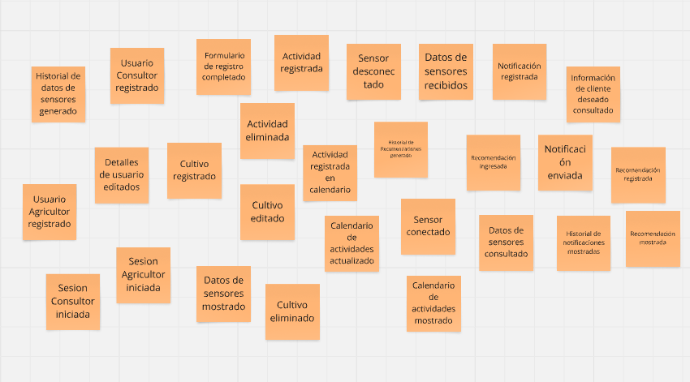
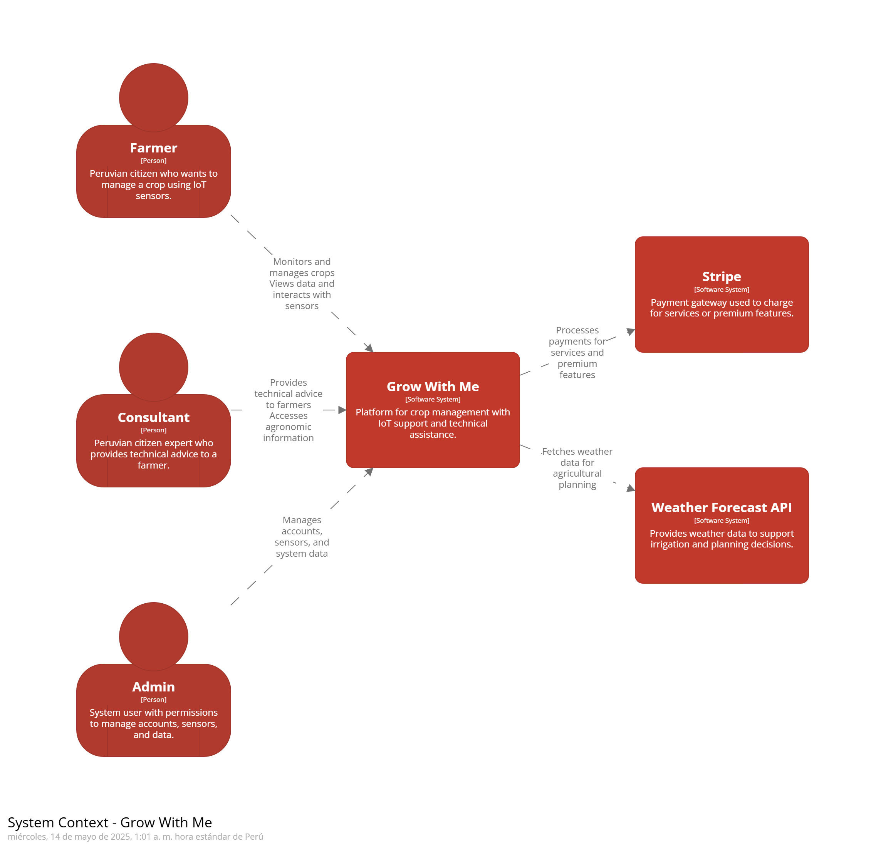
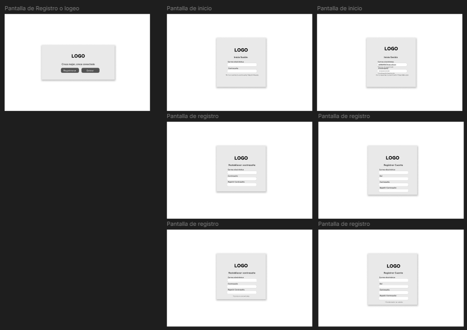
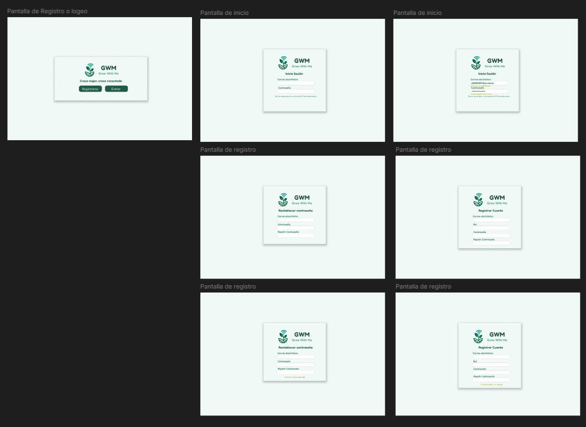

    <strong>Universidad Peruana de Ciencias Aplicadas</strong>     
    </img> 
    <strong>Ingeniería de Software</strong> 
     <strong>Desarrollo de soluciones IoT - 2939</strong> 
     <strong>Docente: León Baca, Marco Antonio</strong>  
     <strong>Informe de Trabajo - TB1</strong> 

    <strong>Startup: Cup of Tech</strong> 
     <strong>Producto: Grow With Me</strong> 

    <h3 align="center">Team Members:</h3>

    <table align="center">
        <tr>
            <th style="text-align:center;">Nombre</th>
            <th style="text-align:center;">Código</th>
        </tr>
        <tr>
            <td style="text-align:center;">Acuña Gomez, Diego Jose</td>
            <td style="text-align:center;">U20201c794</td>
        </tr>
        <tr>
            <td style="text-align:center;">Landeo Simeón, Favio Sebastián</td>
            <td style="text-align:center;">U202119588</td>
        </tr>
        <tr>
            <td style="text-align:center;">Morin Fuentes, Jean Pierre</td>
            <td style="text-align:center;">U202115348</td>
        </tr>
        <tr>
            <td style="text-align:center;">Noriega Suschenko, Anatoly Andrey</td>
            <td style="text-align:center;">U202211813</td>
        </tr>
        <tr>
            <td style="text-align:center;">Oneglio De Paz, Beth Shantal</td>
            <td style="text-align:center;">U202213423</td>
        </tr>
        <tr>
            <td style="text-align:center;">Tongo Alejandro, Milagros Salet</td>
            <td style="text-align:center;">U20216078</td>
        </tr>
    </table>
    

</body>

 <strong>Abril del 2025</strong>

 

---

# Registro de Versiones del Informe

<table>
  <tr>
    <th style="text-align:center;">Versión</th>
    <th style="text-align:center;">Fecha</th>
    <th style="text-align:center;">Autor</th>
    <th style="text-align:center;">Descripción de la modificación</th>
  </tr>
  <tr>
    <td align="center">1.00</td>
    <td>21/04/2025</td>
    <td> Todos los integrantes del equipo.</td>
    <td>Desarrollamos la descripción de nuestro startup Grow With Me, junto a la presentación del equipo que impulsará el desarrollo del sistema. Analizamos a la competencia, identificando nuestro valor diferencial dentro del nicho. Además, definimos con claridad la problemática que buscamos resolver, proponiendo una solución innovadora y centrada en las necesidades reales del usuario.</td>
  </tr>
  <tr>
    <td align="center">2.00</td>
    <td>14/05/2025</td>
    <td> Todos los integrantes del equipo.</td>
    <td>Desarrollamos el Sprint 1 de la entrega junto a los lineamientos del software que incluye instalación, configuración y evidencias de despliegue.</td>
  </tr>
</table>

---

# Project Report Collaboration Insights

TB1: Las tareas asignadas para la entrega TB1 se han completado y están documentadas en el repositorio de Github.

- Se escribieron y diagramaron los contenidos asignados a cada miembro en formato Markdown, seguido de commits para asegurar el progreso en el repositorio.

Enlace del repositorio: https://github.com/upc-2402-1ASI0572-2939-GrowWithMe/Final-Project-Documentation-Report

---
# Contenido 
## Tabla de contenidos

### [Capítulo I: Introducción](#capítulo-i-introducción)
  - [1.1 Startup Profile](#11-startup-profile)
    - [1.1.1 Descripción de la Startup](#111-descripción-de-la-startup)
    - [1.1.2 Perfiles de integrantes del equipo](#112-perfiles-de-integrantes-del-equipo)
  - [1.2 Solution Profile](#12-solution-profile)
    - [1.2.1 Antecedentes y problemática](#121-antecedentes-y-problemática)
    - [1.2.2 Lean UX Process](#122-lean-ux-process)
      - [1.2.2.1 Lean UX Problem Statements](#1221-lean-ux-problem-statements)
      - [1.2.2.2 Lean UX Assumptions](#1222-lean-ux-assumptions)
      - [1.2.2.3 Lean UX Hypothesis Statements](#1223-lean-ux-hypothesis-statements)
      - [1.2.2.4 Lean UX Canvas](#1224-lean-ux-canvas)
  - [1.3 Segmentos objetivo](#13-segmentos-objetivo)

### [Capítulo II: Requirements Elicitation \& Analysis](#capítulo-ii-requirements-elicitation--analysis)
  - [2.1 Competidores](#21-competidores)
    - [2.1.1 Análisis competitivo](#211-análisis-competitivo)
    - [2.1.2 Estrategias y tácticas frente a competidores](#212-estrategias-y-tácticas-frente-a-competidores)
  - [2.2 Entrevistas](#22-entrevistas)
    - [2.2.1 Diseño de entrevistas](#221-diseño-de-entrevistas)
    - [2.2.1 Diseño de entrevistas](#221-diseño-de-entrevistas)
    - [2.2.2 Registro de entrevistas](#222-registro-de-entrevistas)
    - [2.2.3 Análisis de entrevistas](#223-análisis-de-entrevistas)
  - [2.3 Needfinding](#23-needfinding)
    - [2.3.1 User Personas](#231-user-personas)
    - [2.3.2 User Task Matrix](#232-user-task-matrix)
    - [2.3.3 User Journey Mapping](#233-user-journey-mapping)
    - [2.3.4 Empathy Mapping](#234-empathy-mapping)
    - [2.3.5 As-is Scenario Mapping](#235-as-is-scenario-mapping)
  - [2.4 Ubiquitous Language](#24-ubiquitous-language)

### [Capítulo III: Requirements Specification](#capítulo-iii-requirements-specification)
  - [3.1 To-Be Scenario Mapping](#31-to-be-scenario-mapping)
  - [3.2 User Stories](#32-user-stories)
  - [3.3 Impact Mapping](#33-impact-mapping)
  - [3.4 Product Backlog](#34-product-backlog)

### [Capítulo IV: Solution Software Design](#capítulo-iv-solution-software-design)
  - [4.1 Strategic-Level Domain-Driven Design](#41-strategic-level-domain-driven-design)
    - [4.1.1 EventStorming](#411-eventstorming)
      - [4.1.1.1 Candidate Context Discovery](#4111-candidate-context-discovery)
      - [4.1.1.2 Domain Message Flows Modeling](#4112-domain-message-flows-modeling)
      - [4.1.1.3 Bounded Context Canvases](#4113-bounded-context-canvases)
    - [4.1.2 Context Mapping](#412-context-mapping)
    - [4.1.3 Software Architecture](#413-software-architecture)
      - [4.1.3.1 Software Architecture System Landscape Diagram](#4131-software-architecture-system-landscape-diagram)
      - [4.1.3.2 Software Architecture Context Level Diagrams](#4132-software-architecture-context-level-diagrams)
      - [4.1.3.3 Software Architecture Container Level Diagrams](#4133-software-architecture-deployment-diagrams)
      - [4.1.3.4 Software Architecture Deployment Diagrams](#4133-software-architecture-deployment-diagrams)
  - [4.2 Tactical-Level Domain-Driven Design](#42-tactical-level-domain-driven-design)
    - [4.2.1 Bounded Context: Profiles](#421-bounded-context-bounded-context-name)
      - [4.2.1.1 Domain Layer](#4211-domain-layer)
      - [4.2.1.2 Interface Layer](#4212-interface-layer)
      - [4.2.1.3 Application Layer](#4213-application-layer)
      - [4.2.1.4 Infrastructure Layer](#4214-infrastructure-layer)
      - [4.2.1.5 Bounded Context Software Architecture Component Level Diagrams](#4215-bounded-context-software-architecture-component-level-diagrams)
      - [4.2.1.6 Bounded Context Software Architecture Code Level Diagrams](#4216-bounded-context-software-architecture-code-level-diagrams)
        - [4.2.1.6.1 Bounded Context Domain Layer Class Diagrams](#42161-bounded-context-domain-layer-class-diagrams)
        - [4.2.1.6.2 Bounded Context Database Design Diagram](#42162-bounded-context-database-design-diagram)
    - [4.2.2 Bounded Context: Crops](#422-bounded-context-another-bounded-context-name)
      - [4.2.2.1 Domain Layer](#4221-domain-layer)
      - [4.2.2.2 Interface Layer](#4222-interface-layer)
      - [4.2.2.3 Application Layer](#4223-application-layer)
      - [4.2.2.4 Infrastructure Layer](#4224-infrastructure-layer)
      - [4.2.2.5 Bounded Context Software Architecture Component Level Diagrams](#4225-bounded-context-software-architecture-component-level-diagrams)
      - [4.2.2.6 Bounded Context Software Architecture Code Level Diagrams](#4226-bounded-context-software-architecture-code-level-diagrams)
        - [4.2.2.6.1 Bounded Context Domain Layer Class Diagrams](#42261-bounded-context-domain-layer-class-diagrams)
        - [4.2.2.6.2 Bounded Context Database Design Diagram](#42262-bounded-context-database-design-diagram)
    - [4.2.3 Bounded Context: Devices](#423-bounded-context-third-bounded-context-name)
      - [4.2.3.1 Domain Layer](#4231-domain-layer)
      - [4.2.3.2 Interface Layer](#4232-interface-layer)
      - [4.2.3.3 Application Layer](#4233-application-layer)
      - [4.2.3.4 Infrastructure Layer](#4234-infrastructure-layer)
      - [4.2.3.5 Bounded Context Software Architecture Component Level Diagrams](#4235-bounded-context-software-architecture-component-level-diagrams)
      - [4.2.3.6 Bounded Context Software Architecture Code Level Diagrams](#4236-bounded-context-software-architecture-code-level-diagrams)
        - [4.2.3.6.1 Bounded Context Domain Layer Class Diagrams](#42361-bounded-context-domain-layer-class-diagrams)
        - [4.2.3.6.2 Bounded Context Database Design Diagram](#42362-bounded-context-database-design-diagram)
    - [4.2.4 Bounded Context: Notifications](#423-bounded-context-third-bounded-context-name)
      - [4.2.4.1 Domain Layer](#4231-domain-layer)
      - [4.2.4.2 Interface Layer](#4232-interface-layer)
      - [4.2.4.3 Application Layer](#4233-application-layer)
      - [4.2.4.4 Infrastructure Layer](#4234-infrastructure-layer)
      - [4.2.4.5 Bounded Context Software Architecture Component Level Diagrams](#4235-bounded-context-software-architecture-component-level-diagrams)
      - [4.2.4.6 Bounded Context Software Architecture Code Level Diagrams](#4236-bounded-context-software-architecture-code-level-diagrams)
        - [4.2.4.6.1 Bounded Context Domain Layer Class Diagrams](#42361-bounded-context-domain-layer-class-diagrams)
        - [4.2.4.6.2 Bounded Context Database Design Diagram](#42362-bounded-context-database-design-diagram)
### [Capítulo V: Solution UI/UX Design](#capítulo-v-solution-uiux-design)
  - [5.1. Style Guidelines](#51-style-guidelines)
    - [5.1.1. General Style Guidelines](#511-general-style-guidelines)
    - [5.1.2. Web, Mobile and IoT Style Guidelines](#512-web-mobile-and-iot-style-guidelines)
  - [5.2. Information Architecture](#52-information-architecture)
    - [5.2.1. Organization Systems](#521-organization-systems)
      - [5.2.1.1. Labeling Systems](#5211-labeling-systems)
      - [5.2.1.2. SEO Tags and Meta Tags](#5212-seo-tags-and-meta-tags)
      - [5.2.1.3. Searching Systems](#5213-searching-systems)
      - [5.2.1.4. Navigation Systems](#5214-navigation-systems)
  - [5.3. Landing Page UI Design](#53-landing-page-ui-design)
    - [5.3.1. Landing Page Wireframe](#531-landing-page-wireframe)
    - [5.3.2. Landing Page Mock-up](#532-landing-page-mock-up)
  - [5.4. Applications UX/UI Design](#54-applications-uxui-design)
    - [5.4.1. Applications Wireframes](#541-applications-wireframes)
    - [5.4.2. Applications Wireflow Diagrams](#542-applications-wireflow-diagrams)
    - [5.4.3. Applications Mock-ups](#543-applications-mock-ups)
    - [5.4.4. Applications User Flow Diagrams](#544-applications-user-flow-diagrams)
  - [5.5. Applications Prototyping](#55-applications-prototyping)
### [Capítulo VI: Product Implementation, Validation \& Deployment](#capítulo-vi-product-implementation-validation--deployment)
  - [6.1. Software Configuration Management](#61-software-configuration-management)
    - [6.1.1. Software Development Environment Configuration](#611-software-development-environment-configuration)
    - [6.1.2. Source Code Management](#612-source-code-management)
    - [6.1.3. Source Code Style Guide \& Conventions](#613-source-code-style-guide--conventions)
    - [6.1.4. Software Deployment Configuration](#614-software-deployment-configuration)
  - [6.2. Landing Page, Services \& Applications Implementation](#62-landing-page-services--applications-implementation)
    - [6.2.1. Sprint 1](#621-sprint-1)
      - [6.2.1.1. Sprint Planning 1](#6211-sprint-planning-1)
      - [6.2.1.2. Aspect Leaders and Collaborators](#6212-aspect-leaders-and-collaborators)
      - [6.2.1.3. Sprint Backlog 1](#6213-sprint-backlog-1)
      - [6.2.1.4. Development Evidence for Sprint Review](#6214-development-evidence-for-sprint-review)
      - [6.2.1.5. Testing Suite Evidence for Sprint Review](#6215-testing-suite-evidence-for-sprint-review)
      - [6.2.1.6. Execution Evidence for Sprint Review](#6216-execution-evidence-for-sprint-review)
      - [6.2.1.7. Services Documentation Evidence for Sprint Review](#6217-services-documentation-evidence-for-sprint-review)
      - [6.2.1.8. Software Deployment Evidence for Sprint Review](#6218-software-deployment-evidence-for-sprint-review)
      - [6.2.1.9. Team Collaboration Insights during Sprints](#6219-team-collaboration-insights-during-sprints)
- [Conclusiones](#conclusiones)
- [Bibliografía](#bibliografía)
- [Anexos](#anexos)

---

# Student Outcome

El curso contribuye al cumplimiento del Student Outcome ABET:

ABET – EAC - Student Outcome 5

Criterio: La capacidad de funcionar efectivamente en un equipo cuyos miembros juntos proporcionan liderazgo, crean un entorno de colaboración e inclusivo, establecen objetivos, planifican tareas y cumplen objetivos.

En el siguiente cuadro se describe las acciones realizadas y enunciados de conclusiones por parte del grupo, que permiten sustentar el haber alcanzado el logro del ABET – EAC - Student Outcome 5.

<table>
    <tr>
        <th style="text-align:center;">Criterio específico</th>
        <th style="text-align:center;">Acciones realizadas</th>
        <th style="text-align:center;">Conclusiones</th>
    </tr>
    <tr>
        <td align="center">Trabaja en equipo para proporcionar liderazgo en forma conjunta</td>
        <td>
            <strong>Acuña Gomez, Diego Jose</strong>  
             
            TB1  A lo largo del desarrollo de este proyecto, he trabajado promoviendo un entorno colaborativo donde cada integrante pudo aportar desde su experiencia. He contribuido activamente en la elaboración y definición de las User Stories, organizando reuniones clave para debatir el alcance del negocio y asegurar una visión compartida. Gracias a esta dinámica de trabajo conjunto, logramos completar con éxito las User Stories y desarrollar los 10 pasos del Event Storming.
             
		TP1 A lo largo del desarrollo de este trabajo, asumí un rol activo en la organización del equipo. Me encargué de segmentar las tareas relacionadas con las User Stories, diseñé mockups y wireflows, desarrollé el dashboard en el frontend y coordiné el despliegue del sistema. Estas acciones permitieron consolidar los avances técnicos y facilitar el trabajo conjunto del grupo.
		  
            <strong>Landeo Simeón, Favio Sebastián</strong>   
            TB1   Durante el desarrollo del proyecto colaboré activamente para lograr los objetivos grupales planeados. Gracias a ello logramos terminar exitosamente las User Stories, los 10 pasos del Event Storming y una Entrevista del segundo segmento objetivo.
             TP1
             Durante este proyecto, lideré el desarrollo del bounded context de dispositivos en el frontend y participé en la configuración del control de versiones usando buenas prácticas de Software Configuration Management. Esto permitió asegurar una estructura técnica ordenada que facilitó la colaboración entre los integrantes del equipo.
              
            <strong>Morin Fuentes, Jean Pierre</strong>   
            TB1   Participé activamente como miembro del equipo, brindando apoyo constante en la elaboración y revisión de la documentación técnica y funcional del proyecto. Además, mantuvimos reuniones frecuentes entre los integrantes del equipo, lo que nos permitió alinear ideas, resolver dudas en conjunto y trabajar de manera más eficiente y coordinada.
             TP1
             Colaboré activamente en este proyecto mediante la creación de mockups, prototipos funcionales y el diseño de las vistas web. Mi aporte fue clave para construir una visión compartida del producto y facilitar el trabajo coordinado en base a entregables visuales validados por el equipo.
              
            <strong>Noriega Suschenko, Anatoly Andrey</strong>   
            TB1   Durante el desarrollo de nuestro proyecto colaboré activamente a lo largo del mismo desarrollando las primeras versiones de las historias de usuario y el product backlog, el impact mapping, una de las entrevistas y los diagramas c4 Model contribuyendo con mi participación al equipo y desarrollar de manera eficaz y eficiente el proyecto.
             TP1
             Durante el desarrollo del proyecto, contribuí en la elaboración de mockups, el desarrollo del módulo de actividades del calendario en el frontend y la definición de los User Flows. Además, participé en la mejora continua del sistema, asegurando coherencia funcional y visual en los entregables.
              
            <strong>Oneglio De Paz, Beth Shantal</strong>   
            TB1   Colaboré activamente en equipo, asumiendo un rol de liderazgo compartido, lo que me permitió fortalecer mis habilidades blandas en organización. Gracias a ello, logramos concluir satisfactoriamente la Entrevista del primer segmento, el To-Be Scenario Mapping, las User Stories y el Product Backlog.
             TP1
             Asumí un rol activo en el diseño del Dashboard y la redacción del Capítulo 6 del informe. Estas tareas me permitieron aportar desde una perspectiva organizativa y visual, apoyando la coordinación del equipo y la consolidación de entregables tanto técnicos como documentales.
              
            <strong>Tongo Alejandro, Milagros Salet</strong>   
            TB1   Como parte del equipo, me encargué de realizar entrevistas y gestionar los bounded context canvas, contribuyendo activamente al liderazgo compartido y a la toma de decisiones grupales, lo que permitió avanzar de manera eficaz en el proyecto.
             TP1
             Durante el trabajo, elaboré lineamientos generales de estilo y definí guías específicas para las plataformas web, móvil e IoT. Gracias a esta estandarización, el equipo pudo mantener una identidad visual coherente en todas las interfaces del sistema.
        </td>
        <td>
          A lo largo del proyecto, el liderazgo compartido y la colaboración activa entre todos los integrantes permitieron cumplir con éxito las actividades clave como entrevistas, User Stories, Event Storming y la elaboración del Product Backlog. Cada miembro aportó desde sus fortalezas, fortaleciendo el trabajo en equipo y asegurando una visión común del proyecto.
        </td>
    </tr>
    <tr>
        <td align="center">Crea un entorno colaborativo e inclusivo, establece metas, planifica tareas y cumple objetivos.</td>
        <td>
            <strong>Acuña Gomez, Diego Jose</strong>   
            TB1   Durante este proyecto, me enfoqué en crear un entorno colaborativo e inclusivo donde todas las voces fueran escuchadas y valoradas. Establecí metas claras junto al equipo, planificamos tareas de forma estratégica y distribuimos responsabilidades de manera equitativa. Gracias a esta organización, pudimos avanzar de forma eficiente y cumplir los objetivos planteados, manteniendo siempre una comunicación abierta y un compromiso constante por parte de todos los miembros.
             TP1
             Durante el desarrollo de este trabajo, fomenté un ambiente inclusivo en el equipo, donde cada integrante pudo expresar sus ideas y propuestas con libertad. Organicé la planificación de tareas clave, definí metas técnicas alcanzables y realicé seguimientos para asegurar el avance continuo del equipo. Gracias a esta organización, pudimos mantener una dinámica clara y eficiente en el desarrollo de funcionalidades y despliegue.
              
            <strong>Landeo Simeón, Favio Sebastián</strong>   
            TB1   A través del proceso de desarrollo de este proyecto he ayudado a crear un entorno colaborativo para lograr cumplir el objetivo en común. Es por eso que hemos logrado concluir las User Stories, los 10 pasos del Event Storming y una entrevista del segundo segmento objetivo.
             TP1
             En este proyecto, aporté a la creación de un entorno colaborativo al coordinar los aspectos técnicos relacionados con el bounded context de dispositivos y la gestión del control de versiones. Esto facilitó una integración fluida del trabajo de todos los miembros, permitiéndonos cumplir objetivos específicos con orden y claridad.
              
            <strong>Morin Fuentes, Jean Pierre</strong>   
            TB1   Apoyé en la elaboración de la documentación técnica y de los diagramas de bounded context, participando activamente en reuniones con el equipo para alinear ideas y mejorar la eficiencia del trabajo conjunto.
             TP1
             Contribuí activamente en el entorno de trabajo colaborativo mediante la elaboración de mockups y prototipos que sirvieron como punto de referencia común para el equipo. Participé en reuniones donde alineamos ideas y planificamos avances, permitiendo mantener claridad sobre los objetivos visuales y técnicos del proyecto.
              
            <strong>Noriega Suschenko, Anatoly Andrey</strong>   
            TB1   A lo largo del trabajo del proyecto he fomentado un entorno colaborativo e inclusivo dentro del equipo participando activamente en las tareas y revisando que ciertos puntos del trabajo fueran concretado aportando con las entrevistas  y digagramas del proyecto.
             TP1
             Durante este trabajo, me involucré de forma activa en distintas etapas del proyecto, promoviendo una comunicación abierta con mis compañeros. Planifiqué y desarrollé tareas relacionadas al calendario y la experiencia de usuario, verificando que los flujos definidos se ejecutaran correctamente y que se cumplieran los objetivos establecidos.
              
            <strong>Oneglio De Paz, Beth Shantal</strong>   
            TB1   Fomenté un entorno colaborativo e inclusivo dentro del equipo, estableciendo metas claras, planificando tareas de manera estratégica y cumpliendo los objetivos propuestos. Esta experiencia fortaleció mis habilidades blandas en organización y liderazgo compartido, y permitió culminar con éxito el Entrevista del primer segmento, el To-Be Scenario Mapping, las User Stories y el Product Backlog.
             TP1
             Contribuí a establecer metas claras y a distribuir las tareas del equipo de manera organizada. Trabajé en la implementación del Dashboard y en el desarrollo documental, promoviendo un ambiente donde cada integrante sabía su responsabilidad y pudo cumplirla de forma colaborativa.
              
            <strong>Tongo Alejandro, Milagros Salet</strong>   
            TB1   Colaboré en la creación de un ambiente inclusivo y organizado, donde establecí metas claras, planifiqué tareas específicas y aseguré que se cumplieran los objetivos, trabajando de cerca con el equipo y revisando constantemente los avances.
             TP1
             Durante este proyecto, propicié un entorno ordenado y colaborativo al definir las guías de estilo para las diferentes plataformas. Estas pautas facilitaron la planificación visual del sistema y permitieron al equipo trabajar con una base común, cumpliendo los objetivos establecidos con coherencia visual y técnica.
        </td>
        <td>
            Gracias a la planificación conjunta y a un ambiente de trabajo inclusivo, el equipo logró coordinarse eficazmente para alcanzar hitos clave del proyecto como las entrevistas, User Stories, Event Storming y el Product Backlog. Esta sinergia fue fundamental para avanzar con claridad hacia los objetivos establecidos.
        </td>
    </tr>
</table>

---

# Capítulo I: Introducción

## 1.1 Startup Profile

Nuestro proyecto se centra en proporcionar una solución que optimice la gestión de productos agrícolas, mejore la calidad de la producción y facilite las operaciones para los productores en la industria agrícola.

### 1.1.1 Descripción de la Startup

Nuestro proyecto agrícola surge a partir de la identificación de una necesidad no satisfecha en la gestión de productos agrícolas, ya que los productores enfrentan desafíos significativos en la supervisión y optimización de sus operaciones. La falta de herramientas precisas para el monitoreo y la toma de decisiones relacionadas con el riego, la conservación del suelo y la gestión de recursos agrícolas genera ineficiencias en sus procesos. Ante esta situación, hemos identificado una oportunidad para implementar una solución tecnológica que permita mejorar la eficiencia operativa y la calidad de los cultivos. Este software, a través del uso de dispositivos de monitoreo y análisis en tiempo real, proporcionará a los agricultores datos precisos sobre las condiciones de sus cultivos, optimizando decisiones clave y permitiendo un manejo más sostenible y rentable de sus recursos.

**Misión:** Impulsar la transformación del sector agrícola mediante soluciones tecnológicas accesibles e innovadoras que optimicen la gestión de cultivos, mejoren la toma de decisiones y promuevan una agricultura más sostenible, eficiente y rentable para los productores.

**Visión:**  Ser la plataforma líder en innovación agrícola en Latinoamérica, reconocida por empoderar a los productores con herramientas inteligentes que revolucionan la forma en que cultivan, cuidan y gestionan sus recursos.

### 1.1.2 Perfiles de integrantes del equipo

##### Diego Jose Acuña Gomez
Mi nombre es Diego Jose Acuña Gomez, tengo 23 años y actualmente estudio en la UPC, donde curso el noveno ciclo de Ingeniería de Software. Me especializo en desarrollo FrontEnd, con experiencia sólida en Angular, y me interesa mucho el enfoque ágil para colaborar eficientemente en equipo y construir productos de valor. Además, estoy explorando el mundo de la ciberseguridad como parte de mi formación profesional.

##### Favio Sebastián Landeo Simeón

Tengo 20 años y actualmente estoy cursando el noveno ciclo de la carrera de Ingeniería de Software. Estoy disponible para ayudar siempre a mis compañeros y además tiendo a generar buenas relaciones sociales con diferentes tipos de personas gracias a mi tolerancia y capacidad de trabajo en equipo. En mis tiempos libres me gusta escuchar música, jugar videojuegos y editar videos.

##### Jean Pierre Morin Fuentes
Mi nombre es Jean Pierre Morin Fuentes tengo 21 años, estoy  el noveno ciclo de la carrera ingenieria de software. Durante la carrera he podido conocer distintas herramientas, frameworks y lenguajes de programacion, de los cuales manejo, C++, Python, C#, Java, HTML entre otros.

##### Anatoly Andrey Noriega Suschenko

Mi nombre es Anatoly Andrey Noriega Suschenko y soy muy apasionado a los videojuegos y a la programación en general. Actualmente tengo 20 años y estoy cursando el séptimo ciclo de mi carrera. Tengo cierto conocimiento y habilidad con los frameworks de Angular, Flutter y Vue. Domino lenguajes como C++, Python, Java, C#, HTML, CSS, GML, Javascript, entre otros.

##### Beth Shantal Oneglio De Paz

Mi nombre es Beth Shantal Oneglio De Paz - u202213423, tengo 20 años y estudio Ingeniería de Software en la UPC. Disfruto trabajar en equipo y resolver problemas digitales. Estoy capacitada para enfrentar situaciones estresantes con responsabilidad y liderazgo. Poseo conocimientos avanzados en gestión y programación, adquiridos en ciclos anteriores. Manejo lenguajes y tecnologías como Python, C++, HTML5, CSS3, .NET, Vue.js, C#, JavaScript, PHP, MongoDB, MySQL, entre otras.

##### Milagros Salet Tongo Alejandro

Mi nombre es Milagros Salet Tongo Alejandro. Soy estudiante de Ingeniería de Software, en el séptimo ciclo, con experiencia en frontend y backend. Manejo frameworks como Angular y Vue, lo que me ha permitido desarrollar proyectos completos. Me considero una persona sociable y generosa, disfruto trabajando en equipo y creo que aprender de los demás es fundamental para mejorar tanto profesional como personalmente.

## 1.2 Solution Profile

Product Name: El nombre elegido para nuestra solución es Grow With Me. Este nombre transmite la idea de crecimiento conjunto entre los productores agrícolas y nuestra plataforma. El proyecto surge a partir de la identificación de una necesidad insatisfecha en la gestión de productos y operaciones agrícolas.

Product Description: La solución IoT Grow With Me es innovadora, ya que integra tecnologías inteligentes para transformar la gestión agrícola tradicional. A través de sensores conectados y una plataforma digital intuitiva, permite a los productores monitorear en tiempo real variables clave como humedad del suelo, temperatura, estado de los cultivos y rendimiento de sus operaciones.

Se encuentra compuesta por 2 secciones:

- Antecedentes y Problemática: Esta sección describe el problema que el proyecto tiene como objetivo resolver. En este se incluyen el enunciado del problema, una descripción de los puntos más importantes que debe resolver la solución, los objetivos y restricciones del proyecto.

- Lean UX Process: Esta sección aplica el Lean UX Process y describe de manera detallada cómo se resolverá el problema mediante el modelo de negocio.

### 1.2.1 Antecedentes y problemática

En los últimos años, el sector agrícola ha enfrentado transformaciones significativas impulsadas por factores globales. Una de las principales preocupaciones es la creciente demanda de alimentos, impulsada por el constante aumento de la población mundial. Según la FAO, para el año 2050 será necesario incrementar en al menos un 70% la producción de alimentos para satisfacer las necesidades de una población global en expansión. Esto impone una enorme presión sobre los sistemas agrícolas actuales, que deben adaptarse para ser más productivos sin comprometer la sostenibilidad.

A esta demanda se suma la urgencia de enfrentar los desafíos derivados del cambio climático. Las condiciones climáticas cada vez más impredecibles afectan directamente el rendimiento de los cultivos, alterando los ciclos agrícolas tradicionales y generando pérdidas considerables. Además, existe una creciente necesidad de adoptar prácticas agrícolas sostenibles que garanticen la conservación del suelo, el uso eficiente del agua y la reducción del impacto ambiental.

Uno de los grandes retos que enfrentan los productores es la dificultad para monitorear y optimizar el crecimiento de los cultivos en tiempo real. Muchos procesos aún se realizan de forma manual o carecen de datos precisos que permitan tomar decisiones informadas. Esta falta de control no solo reduce la eficiencia, sino que también pone en riesgo la calidad y seguridad de los productos que llegan al consumidor final.

En este contexto, surge la necesidad de implementar soluciones tecnológicas innovadoras que mejoren la productividad, aseguren la calidad de los alimentos y contribuyan a una agricultura más inteligente y resiliente. La tecnología IoT aplicada a la agricultura —como la que propone Grow With Me— representa una respuesta directa a estas problemáticas, permitiendo a los productores optimizar sus operaciones y responder de manera más ágil y eficiente a los desafíos del sector.

### Problemática (5Ws y 2Hs)

##### What (Qué)
##### ¿Cuál es el problema?

La gestión de productos agrícolas y la optimización de operaciones para productores en la industria agrícola.

#### Where (Dónde)

##### ¿Dónde está el usuario cuando usa el producto?

En áreas rurales y regiones agrícolas, campos de cultivos o huertas.

##### ¿Dónde surge el problema?

En las grandes y pequeñas empreas agricolas , asi como agricolas independientes.

##### Why (Por Qué)

##### ¿Cuál es la causa del problema?

Debido a la creciente demanda de alimentos, la necesidad de aumentar la productividad agrícola y los desafíos asociados con el cambio climático y la sostenibilidad.

##### When (Cuándo)

##### ¿Cuándo sucede el problema?

Cuando la población mundial está en constante crecimiento y la presión sobre la producción agrícola es cada vez mayor debido a factores como el cambio climático

##### Who (Quién)

##### ¿Quiénes están involucrados?

Productores agrícolas, empresas grandes y pequeñas del sector agroindustrial.

##### How (Cómo)

##### ¿En qué condiciones los usuarios usan nuestro producto?

Utilizando celulares, tablets, donde tienen colaboraciones con expertos en agricultura y desarrollo de soluciones personalizadas.

##### ¿Cómo nos conoceran los usuarios?

Los usuarios pueden conocer nuestra plataforma a través de diversas vías. Algunas de las más comunes incluyen:

- Boca a boca: La recomendación de amigos, familiares o colegas que ya han utilizado la plataforma y han tenido experiencias positivas.
- Redes sociales: Publicaciones, anuncios o menciones en plataformas como Facebook, Twitter, Instagram, entre otras.
- Colaboraciones con influencers: Asociaciones con figuras prominentes en el mundo de la literatura y el arte que promueven la plataforma a sus seguidores.

##### How much (Cuánto)

El impacto económico puede variar según el alcance y la implementación de las soluciones propuestas, pero el potencial de mejora en eficiencia y calidad es significativo.

Conclusión (5W y 2H):  La gestión agrícola enfrenta retos por el cambio climático y la creciente demanda de alimentos. *Grow With Me* surge como una solución tecnológica accesible para productores, mejorando eficiencia y calidad en zonas rurales. Su impacto es significativo y su difusión se apoya en redes sociales, recomendaciones y alianzas estratégicas.

### 1.2.2 Lean UX Process

#### 1.2.2.1 Lean UX Problem Statements

El desafío que enfrentan los agricultores radica principalmente en la monitorización del crecimiento de los cultivos, ya que la falta de herramientas efectivas dificulta la detección temprana de problemas, como condiciones climáticas adversas, plagas o deficiencias nutricionales. Esto puede resultar en pérdidas significativas de cosechas y una disminución de la calidad de los productos agrícolas. Además, los productores agrícolas luchan por optimizar sus operaciones, debido a la ausencia de herramientas que faciliten desde la planificación de cultivos hasta la gestión de la mano de obra y la logística, lo que limita su capacidad para mejorar la eficiencia y productividad en sus actividades.

Nuestra solución, "Grow With Me", está diseñada específicamente para resolver estos problemas. Nos enfocaremos en proporcionar herramientas inteligentes y accesibles para los agricultores, permitiéndoles monitorear el crecimiento de los cultivos en tiempo real, detectar problemas tempranos y tomar decisiones informadas. Con nuestra plataforma, los agricultores podrán optimizar cada etapa del proceso agrícola, desde la planificación hasta la cosecha, gestionando mejor los recursos y las operaciones logísticas, lo que se traducirá en mayor productividad y calidad en los productos.

Sabemos que los agricultores necesitan soluciones prácticas y eficaces, por lo que "Grow With Me" proporcionará información en tiempo real, alertas personalizadas y herramientas de gestión adaptadas a sus necesidades específicas. Esto les permitirá mejorar la rentabilidad, reducir pérdidas y lograr operaciones más sostenibles y eficientes.

#### 1.2.2.2 Lean UX Assumptions

##### Features

- Herramientas de monitorización del crecimiento de cultivos: Sensores agrícolas para recopilar datos sobre condiciones ambientales, humedad del suelo, y salud de los cultivos.
- Plataforma integrada de gestión agrícola: Suite de herramientas que abarca la planificación de cultivos, gestión de la mano de obra, monitoreo de inventario, programación de riego, y seguimiento de costos y funcionalidades de análisis de datos para identificar áreas de mejora y optimizar la eficiencia operativa en todas las etapas de la producción agrícola.

##### Business Outcomes

- Mejora de la eficiencia operativa: Reducción de los tiempos de inactividad y los costos asociados con la gestión manual de inventario y la resolución de problemas en la cadena de suministro y optimización de los procesos agrícolas mediante la automatización y la aplicación de datos en tiempo real para la toma de decisiones.

- Aumento de la rentabilidad: Reducción de las pérdidas debido a errores en la gestión de inventario, enfermedades de cultivos no detectadas y problemas logísticos y mejora de la productividad y la calidad de los productos agrícolas, lo que puede traducirse en mayores márgenes de beneficio para los productores.
- Reducción de riesgos y cumplimiento normativo: Mayor capacidad para responder rápidamente a problemas emergentes, como brotes de enfermedades o eventos climáticos extremos, minimizando el impacto en la producción y la distribución.

##### Users

Los usuarios son productores agrícolas, empresas agroindustriales grandes y pequeñas y expertos en agricultura.

##### User Outcomes & Benefits

- Productores agrícolas: Granjas y agrícolas que cultivan una variedad de productos, desde cultivos básicos hasta productos de especialidad

- Empresas agroindustriales grandes y pequeñas: Empresas dedicadas al procesamiento, envasado y distribución de productos agrícolas, incluyendo cooperativas y asociaciones de productores.

- Expertos en agricultura: Agrónomos, investigadores y consultores que proporcionan asesoramiento técnico y estratégico a los productores agrícolas para mejorar sus prácticas y rendimiento.

##### User assumptions

##### ¿Quién es el usuario?

El usuario es típicamente un productor agrícola o un gerente de una empresa agroindustrial que busca mejorar la eficiencia y calidad de la producción agrícola.

##### ¿Dónde encaja nuestro producto en sus trabajos o vidas?

Nuestro producto encaja en su día a día al facilitar la gestión de productos agrícolas, desde el cultivo hasta la distribución, optimizando operaciones y mejorando la calidad del producto final.

##### ¿Qué problema resuelve nuestro producto?

Nuestro producto resuelve problemas como la ineficiencia en la gestión de inventario, y la dificultad para monitorear el crecimiento de cultivos, mejorando la eficiencia operativa y la calidad de la producción agrícola.

##### ¿Cuándo y cómo es usado nuestro producto?

Nuestro producto es utilizado a lo largo de todo el ciclo de producción agrícola, desde la planificación de cultivos hasta la distribución, a través de una plataforma digital accesible desde dispositivos móviles o computadoras.

##### ¿Qué características son importantes?

Las caracteristicas de seguimiento de la cadena de suministro en tiempo real, gestión automatizada de inventario, herramientas de monitorización de cultivos, trazabilidad de productos, y análisis de datos para la toma de decisiones informadas.

##### ¿Cómo debería verse y comportarse nuestro producto?

Nuestro producto debe ser una interfaz intuitiva y fácil de usar, con visualizaciones claras de datos y herramientas de análisis poderosas. Debería ser confiable, escalable y adaptable a las necesidades específicas de cada usuario.

##### Business Assumptions

1. **Creemos que nuestros clientes necesitan** una solución que les permita gestionar eficientemente sus operaciones agrícolas, desde el cultivo hasta la distribución, mejorando la eficiencia y la calidad de la producción.
2. **Estas necesidades se pueden resolver con una** plataforma digital que integre funciones de seguimiento del clima, gestión de inventario, monitorización de cultivos y análisis de datos, proporcionando herramientas poderosas para la toma de decisiones informadas.
3. **El valor #1 que mi cliente quiere de mi servicio** es la mejora en la eficiencia operativa y la calidad de la producción agrícola, lo que les permite maximizar los rendimientos y la rentabilidad.
4. **El cliente también puede obtener beneficios adicionales como** un mejor manejo de sus cultivos ya que estaran atentos del clima y plagas y sabran como tratarlas.
5. **Voy a adquirir la mayoría de mis clientes** a través de campañas de marketing dirigidas a productores agrícolas y redes sociales.
6. **Haré dinero a través de** modelos de suscripción mensual o anual por el uso de nuestra plataforma.
7. **Mi competencia principal en el mercado** son otras soluciones de gestión agrícola existentes, tanto tradicionales como digitales.
8. **Los venceremos debido a la simplicidad** .y facilidad de uso de nuestra plataforma, así como a su capacidad para ofrecer una solución integral y altamente personalizable que se adapte a las necesidades específicas de cada cliente
9. **El mayor riesgo es que** los clientes no adopten nuestra solución debido a la resistencia al cambio o a la falta de conocimiento tecnollogico.
10. **Resolveremos esto a través de** demostraciones y pruebas gratuitas de nuestra plataforma, y proporcionando un sólido soporte al cliente para garantizar una implementación exitosa y una experiencia positiva del usuario.

#### 1.2.2.3 Lean UX Hypothesis Statements

A continuación, se presentan las hipótesis que proponen una solución a la problemática dentro de las funcionalidades de la solución tecnológica. Cada una de estas hipótesis es clara y cuantificable, lo que permitirá evaluar el éxito de manera objetiva. Es importante destacar que las métricas actuales corresponden a promedios generales de soluciones ya existentes.
#### Hipótesis 1:

**Creemos que** al implementar un sistema de seguimiento en tiempo real de la cadena de suministro agrícola  
**Sabemos que** los productores podrán mejorar la visibilidad y la eficiencia de sus operaciones, reduciendo los tiempos de inactividad y los costos asociados.

**Métricas:**
- Reducción en el tiempo de inactividad de las operaciones en un **15%**.
- Reducción de los costos operativos relacionados con el transporte y almacenamiento en un **10%**.
- Aumento en la visibilidad de las operaciones (medido a través de la cantidad de información en tiempo real disponible para los productores).
- Mejora en la coordinación de la cadena de suministro, reflejada en un **20%** de reducción en errores de logística.

---

#### Hipótesis 2:

**Creemos** que al proporcionar herramientas de monitorización de cultivos basadas en datos en tiempo real  
**Sabemos que** los productores podrán identificar y abordar de manera proactiva problemas de salud de los cultivos, mejorando así el rendimiento y la calidad de la cosecha.

**Métricas:**
- Reducción en las pérdidas por enfermedades o plagas en un **25%** debido a la detección temprana.
- Mejora en el rendimiento de los cultivos en un **20%**.
- Aumento en la calidad de la cosecha, medido por un **10%** de mejora en la clasificación de calidad (porcentaje de cultivos que cumplen con estándares más altos).
- Tiempo promedio de respuesta ante problemas identificados (plagas, enfermedades, deficiencias) disminuido en un **30%**.

---

#### Hipótesis 3:

**Creemos que** al proporcionar análisis de datos avanzados y recomendaciones personalizadas para la gestión agrícola  
**Sabemos que** los productores podrán tomar decisiones más informadas y estratégicas, mejorando la productividad y la rentabilidad de sus operaciones agrícolas.

**Métricas:**
- Aumento de la productividad en un **15%** debido a decisiones más informadas sobre el manejo de cultivos, recursos y tiempos.
- Incremento en la rentabilidad en un **10%** debido a la optimización de recursos y mejores prácticas agrícolas.
- Porcentaje de usuarios que reportan estar satisfechos con las recomendaciones personalizadas (objetivo de **85%** o más).
- Reducción de desperdicios de recursos (agua, fertilizantes, etc.) en un **20%**, gracias a las recomendaciones basadas en datos.

#### 1.2.2.4 Lean UX Canvas

<TABLE BORDER>
	<TR>
		<TD ROWSPAN=2>
    Lean UX Canvas
    </TD>
	  <TD ROWSPAN=2></TD>
    <TD>Fecha: 6/04/2025</TD>
	</TR>
	<TR>
		<TD>Iteración 1

</TD> 
	</TR>
  <TR>
		<TD ROWSPAN>
      1. Problema de negocios: Los productores agrícolas enfrentan dificultades para gestionar eficientemente sus operaciones debido a los cambios climaticos y plagas , lo que resulta en ineficiencias en la cadena de suministro, pérdidas de cultivos y productos, y una falta de transparencia en la trazabilidad de los productos agrícolas.
    </TD>
	  <TD ROWSPAN=2>
      5. Ideas de solución: Desarrollar una aplicacion que integre seguimiento en tiempo real , monitorización del clima, y aviso de plagas.
    </TD> 
    <TD ROWSPAN=2>
      2. Resultados comerciales:
      
 Mejora en la calidad del producto.
      
 Aumento de la satisfacción del cliente.
    </TD>
	</TR>
	<TR>
		<TD>     
      3. Usuarios y Clientes: Pequeñas empresas y grandes empresas agrícolas.
    </TD> 
	</TR>
  <TR>
		<TD ROWSPAN=2>
      6. Hipótesis
      
 Hipótesis 1:
      Creemos que al implementar un sistema de seguimiento en tiempo real de la cadena de suministro agrícola.
      Sabremos que los productores podrán mejorar la visibilidad y la eficiencia de sus operaciones, reduciendo los tiempos de inactividad y los costos asociados.
      
 Hipótesis 2:
      Creemos que al proporcionar herramientas de monitorización de cultivos basadas en datos en tiempo real.
      Sabremos que los productores podrán identificar y abordar de manera proactiva problemas de salud de los cultivos, mejorando así el rendimiento y la calidad de la cosecha.
      
 Hipótesis 3:
      Creemos que al proporcionar análisis de datos avanzados y recomendaciones personalizadas para la gestión agrícola.
      Sabremos que los productores podrán tomar decisiones más informadas y estratégicas, mejorando la productividad y la rentabilidad de sus operaciones agrícolas.
    </TD>
    <TD ROWSPAN=2>
      7. ¿Qué es lo más importante que debemos aprender primero?
      
 Lo más importante que debemos aprender primero es comprender a fondo las necesidades y desafíos específicos de nuestros usuarios y clientes en la industria agrícola. Esto incluye entender sus procesos operativos, identificar los problemas más urgentes que enfrentan en la gestión de cultivos y conocer sus expectativas y prioridades en cuanto a soluciones tecnológicas.
    </TD>
    <TD>
      4. Beneficios del usuario:
      
 - Mejora de la eficiencia operativa y la rentabilidad para los productores agrícolas.
      
 - Reducción de pérdidas de cultivos y productos debido a una gestión más eficiente de la cadena de suministro.
    </TD>
	</TR>
	<TR>
		<TD>
      8. ¿Cuál es la menor cantidad de trabajo que necesitamos para resolver las dudas y para hacer lo siguiente más importante?
      
 La menor cantidad de trabajo que necesitamos para resolver las dudas y avanzar en lo siguiente más importante es realizar una investigación inicial centrada en los usuarios y clientes potenciales. Esto puede incluir, encuestas u otros métodos de investigación para comprender mejor sus necesidades, desafíos y expectativas. 
      
 Una vez que tengamos una comprensión sólida de las necesidades de los usuarios, podemos priorizar el desarrollo de características y funcionalidades de nuestra solución que aborden directamente esos problemas identificados. Esto nos permitirá enfocarnos en lo más importante para nuestros usuarios y garantizar que nuestra solución sea relevante y útil desde el principio.
    </TD>
  </TR>
</TABLE>

---

## 1.3 Segmentos objetivo

<TABLE BORDER>
  <TR>
    <TD><strong>Tipo de usuario</strong></TD>
    <TD><strong>Geográfico</strong></TD>
    <TD><strong>Psicográfico</strong></TD> 
    <TD><strong>Demográfico</strong></TD>
  </TR>
  <TR>
    <TD>Pequeños y Grandes Agricultores</TD> 
    <TD>Puede estar ubicado en cualquier campo o zona de cultivo.</TD> 
    <TD>
      - Busca mejorar la eficiencia y calidad de su producción. 
      - Creativo y curioso. 
      - Desea apoyo en su cultivo.
    </TD> 
    <TD>
      - Edad: Desde adultos jóvenes hasta adultos mayores.
    </TD>
  </TR>
  <TR>
    <TD>Consultores</TD> 
    <TD>Especializados en el rubro agrícola.</TD> 
    <TD>
      - Quiere ayudar a las empresas pequeñas y grandes a tener un mejor cuidado con sus plantas. 
      - Desea estar atento a las peticiones de contrato y ayuda de los clientes. 
      - Le gusta ver que sus clientes salgan satisfechos con sus consejos.
    </TD> 
    <TD>
      - Edad: Desde adultos jóvenes hasta adultos mayores.
    </TD>
  </TR>
</TABLE>

# Capítulo II: Requirements Elicitation & Analysis

## 2.1 Competidores

Dentro del mercado al que planeamos brindar una solución, pudimos identificar varios competidores que ofrecen una solución con un enfoque similar para la gestión agrícola. A continuación, resumiremos su solución de Software:

**Agrobit:** Agrobit es una herramienta de gestión de gestión agrícola y ganadera que busca nuevas formas de producir alimentos de manera sustentable y rentable. Esta solución tiene como enfoque las grandes empresas. Su plataforma cuenta con funciones como, control de actividades, evolución de cultivos y monitoreo predictivo y trazabilidad y huella de carbono.  
**Efemis:** Efemis es una plataforma digital para la gestión agricola, utiliza imagenes satelitales, predicciones del clima y sensores para controlar los costes y optimizar los costes de operaciones agricolas. Es una iniciativa creada por hispatec que cuenta con soluciones diferentes para el sector agrícola para tareas más especificas, sin embargo, Efemis es la principal. 
**Agri:** Agri es un software especializado en el sector agrícola que permite gestionar órdenes de aplicación, control de faenas, cosecha y riego, entre otras funciones. Para acceder a sus servicios, el territorio agrícola debe ser revisado y categorizado por el tamaño del mismo, posteriormente se hace un cobro mensual que va desde 320 dólares para las pequeñas empresas agrícolas hasta 715 dólares para las empresas agrícolas grandes. 

### 2.1.1 Análisis competitivo

### 2.1.1. Análisis Competitivo 

<table>
<colgroup>
<col style="width: 9%" />
<col style="width: 11%" />
<col style="width: 21%" />
<col style="width: 19%" />
<col style="width: 19%" />
<col style="width: 17%" />
</colgroup>
<thead>
<tr class="header">
<th colspan="6"><strong>Competitive Analysis Landscape</strong></th>
</tr>
</thead>
<tbody>
<tr class="odd">
<td colspan="6"><em>¿Por qué llevar al cabo este análisis</em>? Debemos llevar a cabo este análisis para poder saber en que se especializan nuestros competidores directos y poder encontrar algún aspecto en el que podamos destacar y llamar la atención del mercado objetivo.
aprender de estos.</td>
</tr>
<tr class="even">
<td colspan="2">Empresas (Aplicación)</td>
<td>
GrowWithMe

</td>
<td>
Agrobit

</td>
<td>
Efemis

</td>
<td>Agri</td>
</tr>
<tr class="odd">
<td rowspan="2"><strong>Perfil</strong></td>
<td>Overview</td>
<td>Software de gestión agricola centrado en la capacitación del usuario que puede adaptarse a sus necesidades</td>
<td>Software enfocado en la gestión de procesos agrícolas y ganaderos con ayuda de herramientas de alta gama</td>
<td>Software de hispatec que gestiona procesos agrícolas utilizando herramientas de alta gama</td>
<td>Agri es una solución de software latina que permite gestionar campos de cultivo de forma centralizada</td>
</tr>
<tr class="even">
<td>¿Qué valor ofrece los clientes?</td>
<td>Esta aplicación está entrada en el usuario y su adaptabilidad, brindandole a este una opción cómoda al alcane de sus manos</td>
<td>Uso de herramientas de alta gama como imagenes satelitales que son una alternativa que brinda una seguridad total</td>
<td>Este software modular, está diseñado para que el usuario quiera añadir más funcionalidades que se acoplen a sus necesidades</td>
<td>Empresa latinoamericana con la que los usuarios se sienten más cómodos</td>
</tr>
<tr class="odd">
<td rowspan="2"><strong>Perfil de Marketing</strong></td>
<td>Mercado objetivo</td>
<td>Nos enfocaremos en los pequeños y grandes agricultores que no hayan implementado tecnología para aligerar su carga laboral</td>
<td>Se centra en el sector ganadero y agrícola que buscan implementar una solucion tecnológica con herramientas de gama alta, como imagenes satelitales</td>
<td>Sector agrícola grande que busca una solución de software para agilizar procesos</td>
<td>Está centrado en pequeñas, medianas y grandes empresas agrícolas</td>
</tr>
<tr class="even">
<td>Estrategias de Marketing</td>
<td>Nos acercaremos a los empresarios agrícolas que no confían en la tecnología para que podamos demostrar la eficacia de esta</td>
<td>Se promociona mediante publicidad como google ads, correos,etc.</td>
<td>Utiliza publicidad y estrategias de marketing</td>
<td>Agri usa sus redes sociales como Instagram y Linkedin para poder difundir sus propuestas de valor</td>
</tr>
<tr class="odd">
<td rowspan="3"><strong>Perfil del producto</strong></td>
<td>Producto &amp; Servicios</td>
<td>Ofrecemos una amplia variedad de recursos para el usuario como, control de inventario, predicciones del clima, sensores de humedad y temperatura, monitoreo de ventas, predicciones para las cosechas y un control de ventas</td>
<td>Cuenta con dos versiones, la ECO, una versión dedicada para una producción netamente sostenible, y la Enterprise, dedicada a conseguir el mayor beneficio económico para la empresa. Ambas opciones cuentan con planes de pago diferentes que varían, dandole a las grandes empresas agricolas más ventajas que a las más pequeñas</td>
<td>Efemis cuenta con un control de costos de operaciones, monitoreos de cumplimiento de normativas,gestion de actividades, tratamientos y riegos,entre otras</td>
<td>Agri cuenta con controles de faenas, compras y bodegaje, control de riego, entre otros.</td>
</tr>
<tr class="even">
<td>Precios &amp; Costos</td>
<td>Planeamos cobrar una comisión por venta de productos, los usuarios podrán acceder a nuestros servicios sin mayor problema</td>
<td>Agrobit cuenta con planes mensuales que rondan los 250 hasta los 1100 dólares</td>
<td>Cuenta con planes principalmente desde los 300 hasta los 900 euros mensuales</td>
<td>Cuenta con 3 planes para los pequeños, medianos y grandes agricultores cuyos costos van desde los 320 hasta los 750 dólares</td>
</tr>
<tr class="odd">
<td>Canales de distribución (Web &amp;/o Móvil)</td>
<td>

Web: Una plataforma web complementaria permite el acceso a mapas de
seguridad y la participación en foros comunitarios.
</td>
<td>

Web: La plataforma también está accesible vía navegador web,
permitiendo una experiencia completa en escritorio.
</td>
<td>

Web: Aunque la experiencia principal es móvil, Waze también ofrece
una plataforma web para la planificación de rutas.
</td>
<td>
Móvil: PeaceApp está disponible como una aplicación móvil tanto
en Android como en iOS, ofreciendo a los usuarios acceso en cualquier
momento y lugar.

Web: Una plataforma web complementaria permite a los usuarios acceder
a mapas interactivos de seguridad, reportar incidentes desde sus
computadoras, y participar en foros comunitarios para compartir
información y consejos de seguridad.
</td>
</tr>
<tr class="even">
<td rowspan="4"><strong>Análisis SWOT</strong></td>
<td>Fortalezas</td>
<td>Contamos con un software ágil, que se verá sujetos a cambios rápidos para acomodarnos a las necesidades del usuario</td>
<td>Cuenta con una reputación y una clientela fiel</td>
<td>Es parte de una corporación grande que facilita acceso a herramientas de gama alta</td>
<td>Cuenta con clientes en todo latinoamerica sobre todo Chile y Perú</td>
</tr>
<tr class="odd">
<td>Debilidades</td>
<td>Sujeta a pruebas</td>
<td>Está cerrada a sus clientes habituales y los clientes nuevos no parecen interesados en su producto</td>
<td>No cuenta con una gran cantidad de clientes, las reseñas no son buenas y está siendo dejada de lado</td>
<td>No parece querer modernizarse más allá de su estado actual</td>
</tr>
<tr class="even">
<td>Oportunidades</td>
<td>Muchas de las gestiones agrícolas en nuestro país son deficientes y gran parte de las cosechas son desperdiciadas, por ello el Perú es un país ideal para implementar GrowWithMe</td>
<td>Dadas sus herramientas presenta una estabilidad que les permitiría desarrollarse más</td>
<td>Cuenta con acceso a herramientas de gama alta que permiten el recopilado de información detallada para beneficio del usuario</td>
<td>Cuenta con el apoyo de clientes de más de un país por ello pueden expandirse por todo latinoamerica</td>
</tr>
<tr class="odd">
<td>Amenazas</td>
<td>La implementación de herramientas costosas por parte de la competencia</td>
<td>Dado que el proceso de cotización es lento, muchos clientes prefieren buscar otras opciones</td>
<td>Sus ventas se han visto reducidas</td>
<td>La creciente tecnología y el uso de la inteligencia artificial puede desplazar a muchas soluciones de software</td>
</tr>
</tbody>
</table>

### 2.1.2 Estrategias y tácticas frente a competidores

Nos enfocaremos en el sector que no cuenta con tecnología, brindando una solución accesible e intuitiva para que personas que no están familiarizadas con el apartado tecnológico puedan dominar para el uso eficiente de sus recursos.

| **Estrategia/Táctica**       | **Medidas a tomar**                                                                                  |
|-------------------|------------------------------------------------------------------|
| **Estrategia General**       | **Diferenciación**                                                                                   |
| **Objetivo Principal**       | Destacar ante la competencia enfocándonos en hacer un producto que pueda satisfacer necesidades específicas de nuestros segmentos objetivos. |
| **Estrategia/Táctica 1**     | **Enfoque al usuario**: Concentrarse en hacer mejoras basadas en lo que nuestros clientes soliciten. |
| **Medidas a tomar 1**        | Realizar encuestas y obtener retroalimentación constante de los usuarios para identificar mejoras y necesidades específicas. |
| **Estrategia/Táctica 2**     | **Control de usuarios**: Control y gestión de usuarios dentro de la aplicación.                      |
| **Medidas a tomar 2**        | Implementar una red interconectada en la que el usuario administrador pueda gestionar y controlar a los trabajadores, monitorizando su rendimiento. |

## 2.2 Entrevistas

### 2.2.1 Diseño de entrevistas

Se diseñaron entrevistas dirigidas a los dos segmentos objetivos definidos para el proyecto. Las preguntas fueron formuladas con el propósito de generar respuestas abiertas y detalladas, lo que permitirá obtener información valiosa para comprender mejor sus necesidades. Es importante señalar que las preguntas de introducción no están incluidas en esta lista, ya que se realizarán al inicio de cada entrevista.

**Segmento Objetivo 1: Agricultores y pymes agrícolas**

1. ¿Cuáles son los cultivos principales que gestionas y qué factores consideras más importantes al tomar decisiones sobre su riego?

Objetivo: Identificar los tipos de cultivos más comunes y los criterios clave que influyen en las decisiones de riego.

2. ¿Cuáles son los mayores desafíos que enfrentas en la gestión del riego en tus cultivos?

Objetivo: Comprender los principales problemas o barreras que dificultan la eficiencia en el riego.

3. ¿Qué herramientas o tecnologías utilizas actualmente para gestionar el riego y cómo impactan en la eficiencia de tus cultivos?

Objetivo: Conocer las soluciones tecnológicas existentes que ya están siendo utilizadas y su efectividad.

4. ¿Cómo tomas decisiones sobre cuándo regar tus cultivos y qué herramientas usas para ello?

Objetivo: Analizar los métodos actuales de toma de decisiones en el riego y los recursos utilizados.

5. ¿Qué factores (como la humedad del suelo, las condiciones climáticas o el tipo de cultivo) consideras al programar el riego?

Objetivo: Determinar las variables que los agricultores consideran prioritarias al definir estrategias de riego.

6. ¿Has utilizado alguna vez sensores o dispositivos para monitorear las condiciones de tus cultivos? Si es así, ¿cómo te han ayudado?

Objetivo: Evaluar la experiencia del usuario con dispositivos de monitoreo y su percepción sobre su utilidad.

7. ¿Qué opinas sobre el uso de una aplicación móvil que te ayude a gestionar el riego y otros aspectos de tus cultivos?

Objetivo: Explorar la disposición y actitud del usuario hacia soluciones móviles para la gestión agrícola.

8. ¿Cuál consideras que es la principal barrera para adoptar nuevas tecnologías de monitoreo y automatización en el riego?

Objetivo: Identificar los factores que limitan la adopción tecnológica en el ámbito agrícola.

9. ¿Qué beneficios esperarías de una solución que te ayude a gestionar el riego de manera más precisa y optimizada según las condiciones reales de tus cultivos?

Objetivo: Detectar las expectativas concretas de los usuarios respecto a soluciones tecnológicas de riego.

10. ¿Te gustaría que la solución te ayudara también con la gestión de otros recursos agrícolas, como fertilizantes o control de plagas?

Objetivo: Analizar el interés de los usuarios en funcionalidades complementarias más allá del riego.

**Segmento Objetivo 2: Consultores agrícolas**

1. ¿Cómo crees que la tecnología puede mejorar la gestión del riego en los cultivos?

Objetivo: Obtener la perspectiva técnica sobre el potencial de la tecnología en el manejo eficiente del riego.

2. ¿Qué desafíos has identificado en el sector agrícola con respecto a la eficiencia del uso del agua y el riego?

Objetivo: Reconocer los problemas estructurales y operativos más comunes en el uso del agua para riego.

3. ¿Qué tecnologías o soluciones actuales ves como más prometedoras para mejorar el manejo del riego en la agricultura?

Objetivo: Identificar tecnologías emergentes o consolidadas que puedan ser implementadas con éxito.

4. ¿Cómo crees que una aplicación que utilice datos sobre la humedad del suelo y otros parámetros podría cambiar las prácticas de riego?

Objetivo: Evaluar el potencial transformador de una solución basada en datos sobre la rutina agrícola.

5. ¿Cuál es tu opinión sobre el uso de tecnologías automáticas para tomar decisiones más precisas sobre el riego y cómo impactaría esto en la productividad?

Objetivo: Analizar la visión experta sobre la automatización en el campo y su impacto directo en los resultados.

6. ¿Qué beneficios ofrecería una solución que te ayude a gestionar los recursos de manera más eficiente en cultivos agrícolas?

Objetivo: Definir el valor agregado que una solución tecnológica podría aportar a la eficiencia del campo.

7. ¿Consideras que los agricultores están preparados para adoptar tecnologías como los sensores para el riego? ¿Por qué?

Objetivo: Evaluar el nivel de preparación y apertura del sector agrícola frente a nuevas tecnologías.

8. ¿Qué tipo de capacitación o soporte sería necesario para que los agricultores adopten nuevas soluciones tecnológicas para el riego?

Objetivo: Determinar los requisitos de formación y acompañamiento necesarios para facilitar la adopción.

9. ¿Cómo evaluarías el impacto de una solución tecnológica en la sostenibilidad de las prácticas agrícolas?

Objetivo: Estimar el alcance ambiental y de sostenibilidad que se podría lograr con la solución propuesta.

10. ¿Qué aspectos adicionales consideras importantes al desarrollar una solución para la gestión del riego y otros recursos agrícolas?

Objetivo: Recoger sugerencias clave para mejorar la propuesta de valor y diseño funcional del producto.

### 2.2.2 Registro de entrevistas
 
**Segmento Objetivo 1: Agricultores y pymes agrícolas**

Todas la entrevistas se encuentran en el siguiente URL: <https://upcedupe-my.sharepoint.com/:v:/g/personal/u202116078_upc_edu_pe/EUjElqA2GVNOuGcMu_3hJJYBPi5VQ-bHC4DnneCE9LZhDw?e=x9rtA0&nav=eyJyZWZlcnJhbEluZm8iOnsicmVmZXJyYWxBcHAiOiJTdHJlYW1XZWJBcHAiLCJyZWZlcnJhbFZpZXciOiJTaGFyZURpYWxvZy1MaW5rIiwicmVmZXJyYWxBcHBQbGF0Zm9ybSI6IldlYiIsInJlZmVycmFsTW9kZSI6InZpZXcifX0%3D>

|                             **Entrevista 1**                              |                                                                                                                                                                                                                                                              **Juan Jesús Calisaya Sánchez**                                                                                                                                                                                                                                                              |
| :-----------------------------------------------------------------------: | :-------------------------------------------------------------------------------------------------------------------------------------------------------------------------------------------------------------------------------------------------------------------------------------------------------------------------------------------------------------------------------------------------------------------------------------------------------------------------------------------------------------------------------------------------------: |
|                           
Edad
                           |                                                                                                                                                                                                                                                                 
21 Años
                                                                                                                                                                                                                                                                  |
|                         
Distrito
                         |                                                                                                                                                                                                                                                                   
Lima
                                                                                                                                                                                                                                                                   |
| 
  
  |                                 
Juan cultiva papa, choclo y hortalizas. Decide cuándo regar observando las plantas, el clima y la humedad del suelo. Los desafíos incluyen la escasez de agua y el riego desigual. Aunque usa herramientas tradicionales, está interesado en una aplicación móvil de riego si es fácil y económica. La principal barrera para adoptar nuevas tecnologías es el costo y la falta de conocimiento. Le gustaría que la solución también gestionara fertilizantes y plagas.
                                  |
|                         
Timing: 
                         |                                                                                                                                                                                                                                                                  
00:04 - 04:58
                                                                                                                                                                                                                                                                   |
|                             **Entrevista 2**                              |                                                                                                                                                                                                                                                               **Aaron Elias Acuña Alarcon**                                                                                                                                                                                                                                                               |
|                           
Edad
                           |                                                                                                                                                                                                                                                                 
21 Años
                                                                                                                                                                                                                                                                  |
|                         
Distrito
                         |                                                                                                                                                                                                                                                                   
Lima
                                                                                                                                                                                                                                                                   |
| 
  
 | 
Aaron cultiva papa, maíz, zanahoria y lechuga. Toma decisiones de riego basándose en el clima, la humedad del suelo y el estado visual de las plantas. Entre los principales desafíos menciona el riego ineficiente y la dificultad para coordinarlo entre diferentes cultivos. Actualmente usa métodos tradicionales y aplicaciones de clima, pero no cuenta con sensores. Está interesado en una aplicación móvil sencilla que lo ayude con el riego. Le gustaría que la solución también le ayude a gestionar fertilizantes y plagas.
 |
|                         
Timing: 
                         |                                                                                                                                                                                                                                                                  
04:58 - 10:43
                                                                                                                                                                                                                                                                   |
|                             **Entrevista 3**                              |                                                                                                                                    **Gabriela Nomberto Ramos**                                                                                                                                                                                                                                                                                                                                            |
|                           
Edad
                           |                                                                                                                                                                                                                                                                    
23 
                                                                                                                                                                                                                                                                     |
|                         
Distrito
                         |                                                                                                                                                                                                                                                                    
 Lima
                                                                                                                                                                                                                                                                     |
|                            
  
                             |                                                                                                                                                                                                                                                                    
Gabriela Nomberto es una agricultora dedicada al cultivo de zanahorias, lechugas y ocasionalmente papas desde 2022. Considera fundamentales factores como el tipo de suelo, el clima y la etapa de crecimiento para decidir el riego. Utiliza riego por aspersión manual y aplicaciones móviles para pronósticos climáticos, aunque señala que no siempre son precisas. Ha probado sensores de humedad, pero menciona que suelen dañarse por las lluvias. Para ella, una app que gestione el riego de forma precisa sería muy útil, y está interesada en herramientas que también optimicen recursos como fertilizantes y control de plagas.
                                                                                                                                                                                                                                                                     |
|                         
Timing: 
                         |                                                                                                                                                                                                                                                                  
10:43 -  17:53
                                                                                                                                                                                                                                                                   |

**Segmento Objetivo 2: Consultores agrícolas**

|                              **Entrevista 1**                              |                                                                                                                                                                                                                                                                                                                                                 **Jeyson Alejandro Rocca**                                                                                                                                                                                                                                                                                                                                                  |
| :------------------------------------------------------------------------: | :-------------------------------------------------------------------------------------------------------------------------------------------------------------------------------------------------------------------------------------------------------------------------------------------------------------------------------------------------------------------------------------------------------------------------------------------------------------------------------------------------------------------------------------------------------------------------------------------------------------------------------------------------------------------------------------------------------------------------: |
|                           
Edad
                            |                                                                                                                                                                                                                                                                                                                                                  
25 Años
                                                                                                                                                                                                                                                                                                                                                   |
|                         
Distrito
                          |                                                                                                                                                                                                                                                                                                                                                    
Lima
                                                                                                                                                                                                                                                                                                                                                    |
| 
  
 | 
Jeyson, ingeniero agrónomo, destacó que la automatización de procesos y la optimización del uso de recursos, especialmente el agua, son claves para mejorar la gestión del riego en la agricultura. Señaló que los desafíos del sector están en la eficiencia del riego y el uso adecuado de los recursos. Considera que tecnologías como sensores y aplicaciones basadas en datos del ambiente y del suelo podrían facilitar estos procesos. Sin embargo, subrayó que, aunque en Lima existe mayor acceso a estas tecnologías, en las provincias los agricultores no están tan capacitados para adoptarlas, por lo que las soluciones deben ser intuitivas y fáciles de usar para garantizar su adopción.
 |
|                         
Timing: 
                          |                                                                                                                                                                                                                                                                                                                                                   
17:57 - 22:44
                                                                                                                                                                                                                                                                                                                                                    |
|                              **Entrevista 2**                              |                                                                                                                                                                                                                                                                                                                                                **Mario Jesús Estrada Ruiz**                                                                                                                                                                                                                                                                                                                                                 |
|                           
Edad
                            |                                                                                                                                                                                                                                                                                                                                                  
25 Años 
                                                                                                                                                                                                                                                                                                                                                  |
|                         
Distrito
                          |                                                                                                                                                                                                                                                                                                                                                   
Lima 
                                                                                                                                                                                                                                                                                                                                                    |
| 
  
  |                              
Mario Estrada trabaja como practicante en una empresa en el rubro agrícola, estudiante de la carrera de Ingeniería Ambiental. Se puede destacar que desde su experiencia las herramientas IoT ya están siendo implementadas. Además, también puntúa que los recursos se podrían manejar de manera más eficiente dentro del ámbito empresarial, él propondría incluir más tecnología en poder detectar deficiencias en el óptimo uso de los recursos como el agua, la electricidad, etc. Por último señaló que cualquier persona con capacitación podría utilizar los dispositivos IoT que se requieren para una buena gestión de los cultivos. 
                               |
|                         
Timing: 
                          |                                                                                                                                                                                                                                                                                                                                                   
22:44 - 31:02
                                                                                                                                                                                                                                                                                                                                                    |
|                              **Entrevista 3**                              |                                                                                                                                                                                                                                                                                                                                                **Camila Pinedo**                                                                                                                                                                                                                                                                                                                                                 |
|                           
Edad
                            |                                                                                                                                                                                                                                                                                                                                                  
29 Años 
                                                                                                                                                                                                                                                                                                                                                  |
|                         
Distrito
                          |                                                                                                                                                                                                                                                                                                                                                   
Lima 
                                                                                                                                                                                                                                                                                                                                                    |
| 
  
  |                              
Camila Pinedo señala que la tecnología puede optimizar el riego agrícola al hacerlo más preciso y eficiente. Identifica como principales retos la falta de acceso, capacitación y resistencia al cambio. Destaca el potencial de sensores, automatización e inteligencia artificial para mejorar el manejo del agua. Considera que una app con datos del suelo y clima facilitaría decisiones más acertadas. Aunque algunos agricultores están preparados, muchos necesitan capacitación y soporte. Finalmente, resalta que toda solución debe ser simple, adaptable y diseñada con enfoque local. 
                               |
|                         
Timing: 
                          |                                                                                                                                                                                                                                                                                                                                                   
31:02 - 35:18
                                                                                                                                                                                                                                                                                                                                                    |

### 2.2.3. Análisis de entrevistas

Tras realizar las entrevistas con los dos segmentos objetivos, se destaca que tanto los agricultores como los consultores agrícolas enfrentan desafíos relacionados principalmente con el uso ineficiente del agua, el riego irregular, y la falta de herramientas tecnológicas accesibles. En general, existe una necesidad de soluciones tecnológicas que ayuden a mejorar la gestión de recursos agrícolas, con un enfoque en el riego eficiente y el control de plagas.

Los agricultores, en su mayoría, están familiarizados con herramientas tradicionales y están dispuestos a adoptar nuevas tecnologías, siempre que sean sencillas, económicas y que proporcionen resultados visibles rápidamente. Las dificultades radican en la resistencia al cambio y la falta de capacitación en el uso de nuevas tecnologías, especialmente fuera de áreas urbanas como Lima.

Por otro lado, los consultores agrícolas coinciden en la importancia de la automatización, el uso de sensores, y la incorporación de inteligencia artificial para gestionar los recursos de manera más eficiente. Sin embargo, también destacan que la capacitación continua es crucial para la correcta adopción de estas tecnologías, ya que muchos agricultores carecen de los conocimientos necesarios para implementar soluciones avanzadas.

En resumen, las entrevistas revelan que tanto los agricultores como los consultores coinciden en que las tecnologías actuales no cumplen completamente con las necesidades del sector, y existe una gran oportunidad para desarrollar herramientas más accesibles, personalizadas y fáciles de usar.

## 2.3 Needfinding

En esta sección, se buscarán las necesidades implícitas y explícitas de las personas o segmentos para poder diseñar y adaptar el producto solución de manera apropiada.

### 2.3.1 User Personas

Se crean los **User Persona**, personajes ficticios que representan al cliente ideal, a partir de la investigación realizada en los capítulos anteriores. Estos perfiles se desarrollan para identificar los distintos tipos de usuarios que podrían hacer uso de la solución propuesta. La herramienta utilizada para la creación de estos **User Persona** fue **UXPressia**.

### 2.3.2 User Task Matrix

A continuación, se presenta la **Matriz de Tareas de Usuario** para los siguientes segmentos objetivo.

| **User Task Matrix**                           | **Aldo Gómez (Agricultor)** |                  | **Antonio Herrera (Consultor)** |                  |
|------------------------------------|------------------------------|------------------|----------------------------------|------------------|
|                                    | **Frequency**               | **Importance**  | **Frequency**                   | **Importance**  |
| Planificar el cultivo de la temporada | Medium                       | High             | Medium                            | High             |
| Comunicarse con trabajadores       | Medium                        | High             | Medium                            | High             |
| Seguimiento de cultivos            | High                         | High             | High                             | High             |
| Revisión de pronóstico del clima   | Medium             | Medium            | Medium                            | High             |
| Riego de plantas                   | Low          | High             | Low                             | High             |
| Identificación de pestes           | Low          | High             | Medium                            | High             |
| Peaje de cosechas                  | Low                         | High             | Low                             | High             |

**Tareas con Mayor Frecuencia e Importancia:**

- **Frecuencia:**
  - *Seguimiento de cultivos* (Alta)

- **Importancia:**
  - *Seguimiento de cultivos* (Alta)

**Principales diferencias y coincidencias:**

- **Coincidencias:**
  - Ambos perfiles coinciden en que el *seguimiento de cultivos* tiene alta frecuencia e importancia.
  
- **Diferencias:**
  - Un perfil tiene tareas de alta importancia como *Planificar el cultivo de la temporada*, *Comunicarse con trabajadores* y *Identificación de pestes*, que no son tan destacadas en el otro perfil.
  - El otro perfil se enfoca más en tareas relacionadas con *Revisión de pronóstico del clima* y *Riego de plantas*, las cuales tienen más importancia para él que para el primero.

### 2.3.3 User Journey Mapping

**Segmento Objetivo 1: Agricultores y pymes agrícolas**  
  
**Segmento Objetivo 2: Consultores agrícolas**  

### 2.3.4 Empathy Mapping

**Segmento Objetivo 1: Agricultores y pymes agrícolas**  
  
**Segmento Objetivo 2: Consultores agrícolas**  

### 2.3.5 As-is Scenario Mapping

**Segmento Objetivo 1: Agricultores y pymes agrícolas**  

**Segmento Objetivo 2: Consultores agrícolas**  

## 2.4 Ubiquitous Language

Ubiquitous language o lenguaje ubicuo hace referencia al lenguaje que puede ser entendido en cualquier parte, esta sección tiene como intención permitirle a personas sin vocabulario de un Ingeniero de software puedan entender. A continuación, mostraremos un glosario con contenido de este proyecto:

<ul>
  <li> Crop: El significado literal es cultivo y usaremos el término como entidad, servicio y componente durante el desarrollo del código. </li>
  <li> Employee: Significa empleado y lo estaremos usando para realizar entidades, servicios y componentes. </li>
  <li> Harvest: El proceso de recoger cultivos madurados de los campos de cultivo. </li>
  <li> Irrigation: La aplicación artificial de agua a la tierra para ayudar en la producción de cultivos. </li>
  <li> Fertilizer: Sustancias que se aplican al suelo del cultivo para incrementar su fertilidad y rendimiento. </li>
  <li> Pesticide: Son químicos utilizados para controlar, repeler y/o eliminar pestes del cultivo. </li>
  <li> Crop rotation: Es la práctica de cultivar diferentes tipos de plantas al mismo tiempo en el mismo área en estaciones secuenciales. </li>
  <li> Fumigation: Es un método de control de pestes o de eliminar microorganismos dañinos en un área específico mediante gases pesticidas. </li>
  <li> Germination: Significa el comienzo del crecimiento, ya sea de una semilla, espora o brote, en respuesta a la temperatura correcta y agua. </li>
</ul>

---

# Capítulo III: Requirements Specification

## 3.1. To-Be Scenario Mapping

Para elaborar el To-be Scenario Mapping, el equipo definió cómo sería el flujo de trabajo después de la implementación de nuestra solución, GrowWithMe, para ambos segmentos objetivos. El propósito de este artefacto es comparar y abordar los aspectos negativos identificados en el As-is Scenario.

**Segmento Objetivo 1: Agricultores y pymes agrícolas**

**Segmento Objetivo 2: Consultores agrícolas**

Enlace del Miro: [To-Be Scenario Mapping](https://miro.com/welcomeonboard/bno3SFQ0ajhWdW9HaXpPTkxuZENJUjVFaEtMdDJ2UVBKaUZYNzhTNEx6Y3dCK2hPNThHbUVDZ3dKbS80dTBGVzkxcjh3WG1rWGZUQTh6QWl2VEhUSnpzMHQ2Zi9lU0JoMzVDdmExc0NDYXQ5VDlySlRwWXE3d3BoSmJvNnI1VElNakdSWkpBejJWRjJhRnhhb1UwcS9BPT0hdjE=?share_link_id=96167492984)

## 3.2. User Stories

| **User/Technical Story ID** | **Título**                           | **Descripción**                                                                                      | **Criterios de Aceptación**                                                                                                                                                                | **Relacionado con (Epic ID)**      |
|---------------------|--------------------------------------|------------------------------------------------------------------------------------------------------|--------------------------------------------------------------------------------------------------------------------------------------------------------------------------------------------|-------------------------------------|
| EPIC01      | Experiencia del Visitante en la Landing Page       | Como visitante de la plataforma, quiero ver de manera clara y simple cómo el sistema IoT puede ayudar a los agricultores, con ejemplos, imágenes e información relevante, para entender su utilidad y beneficios. | No corresponde. | No corresponde. |
| EPIC02      | Gestión de Cultivos                                | Como agricultor, quiero gestionar mis cultivos para mantener un control eficiente.                                                              | No corresponde. | No corresponde. |
| EPIC03      | Dispositivos IoT                                   | Como agricultor, quiero gestionar mis dispositivos IoT para automatizar el monitoreo.                                                           | No corresponde. | No corresponde. |
| EPIC04      | Configuración de perfil                            | Como agricultor, quiero personalizar mi perfil para mantenerlo actualizado.                                                                     | No corresponde. | No corresponde. |
| EPIC05      | Dashboard de datos                                 | Como agricultor, quiero exportar los datos de mis cultivos para analizarlos externamente.                                                       | No corresponde. | No corresponde. |
| EPIC06      | Notificaciones al agricultor                       | Como agricultor, quiero recibir y gestionar notificaciones importantes sobre mis cultivos.                                                      | No corresponde. | No corresponde. |
| EPIC07      | Interacción Consultor-Agricultor                   | Como consultor, quiero interactuar con los agricultores para darles asistencia técnica.                                                         | No corresponde. | No corresponde. |
| EPIC08      | Desarrollo de una API REST para la gestión de la agricultura | Como equipo, queremos tener una API REST completa para que me permita gestionar eficientemente todas las operaciones agrícolas de los agricultores, consultores y dispositivos IoT. | No corresponde. | No corresponde. |
| US01 | Diseño informativo y atractivo | Como visitante, quiero una landing page clara y atractiva que explique los beneficios del sistema IoT para la agricultura, con ejemplos e imágenes, para entender su utilidad y beneficios. | **Escenario 1: Visualización clara y completa de la landing page** **Dado que** un visitante accede a la landing page, **Cuando** la página carga completamente, **Entonces** se muestra una interfaz organizada con secciones de beneficios, ejemplos e imágenes, **Y** la información es presentada de manera sencilla y comprensible.  **Escenario 2: Fallo en carga de contenido** **Dado que** un visitante accede a la landing page, **Cuando** ocurre un error al cargar los elementos, **Entonces** se muestra un mensaje de error de carga, **Y** se ofrece la opción de recargar la página. | EPIC01 |
| US02 | Funcionalidad de botones Call-to-Action | Como visitante, quiero disponer de botones y enlaces estratégicos para acceder a más información, facilitando mi interacción con el producto. | **Escenario 1: Funcionamiento correcto de los botones** **Dado que** un visitante visualiza la landing page, **Cuando** hace clic en un botón del header, **Entonces** es redirigido correctamente, **Y** la navegación ocurre sin errores.  **Escenario 2: Enlace roto** **Dado que** un visitante hace clic en un botón, **Cuando** el enlace no está correctamente configurado, **Entonces** se muestra un mensaje de error 404, **Y** el visitante permanece en la misma página. | EPIC01 |
| US03 | Registrar cultivos | Como agricultor, quiero registrar mis cultivos para tener un control personalizado. | **Escenario 1: Registro exitoso** **Dado que** estoy en la sección 'Mis Cultivos', **Cuando** completo todos los campos obligatorios, **Entonces** el sistema guarda el cultivo exitosamente, **Y** se muestra un mensaje de confirmación.  **Escenario 2: Registro fallido** **Dado que** dejo campos obligatorios vacíos, **Cuando** intento guardar el cultivo, **Entonces** el sistema muestra un mensaje de error, **Y** no se guarda la información. | EPIC02 |
| US04 | Gestionar cultivos | Como agricultor, quiero editar y eliminar cultivos para mantener mi información actualizada. | **Escenario 1: Edición o eliminación exitosa** **Dado que** estoy en la vista de mis cultivos, **Cuando** edito o elimino uno correctamente, **Entonces** los cambios deberían reflejarse.  **Escenario 2: Eliminación no confirmada** **Dado que** intento eliminar un cultivo, **Cuando** no confirmo la acción, **Entonces** no debería eliminarse. | EPIC02 |
| US05 | Añadir actividad al calendario | Como agricultor, quiero añadir actividades a mi calendario para planificar mis tareas de cultivo. | **Escenario 1: Actividad añadida exitosamente** **Dado que** accedo a 'Mis Cultivos' y luego a 'Calendario de actividades', **Cuando** ingreso una nueva actividad con todos los datos requeridos, **Entonces** debe añadirse correctamente.  **Escenario 2: Datos incompletos** **Dado que** dejo campos vacíos, **Cuando** intento guardar la actividad, **Entonces** debe mostrarse un mensaje de error. | EPIC02 |
| US06 | Ver calendario de actividades | Como agricultor, quiero ver un calendario con riegos, siembras y cosechas para planificarme. | **Escenario 1: Visualización con actividades** **Dado que** tengo actividades registradas, **Cuando** accedo al calendario, **Entonces** deberían mostrarse organizadas por fecha.  **Escenario 2: Calendario vacío** **Dado que** no hay actividades registradas, **Cuando** ingreso al calendario, **Entonces** debe mostrarse un mensaje informativo. | EPIC02 |
| US07 | Conectar dispositivos IoT | Como agricultor, quiero conectar mis dispositivos IoT para monitorear datos en tiempo real. | **Escenario 1: Conexión exitosa** **Dado que** ingreso correctamente las credenciales del dispositivo, **Cuando** presiono "Conectar", **Entonces** el sistema debería mostrar una confirmación de éxito. **Y** comenzar a mostrar datos en tiempo real.  **Escenario 2: Conexión fallida** **Dado que** las credenciales son incorrectas, **Cuando** intento conectar, **Entonces** debe mostrarse un mensaje de error, **Y** el dispositivo no debe añadirse. | EPIC03 |
| US08 | Desconectar dispositivos | Como agricultor, quiero desconectar dispositivos cuando ya no los necesite conectados para ahorrar energía. | **Escenario 1: Desconexión exitosa** **Dado que** tengo un dispositivo conectado, **Cuando** presiono "Desconectar", **Entonces** el dispositivo debería quedar inactivo, **Y** el sistema debe actualizar el estado del dispositivo a "desconectado".  **Escenario 2: Error técnico al desconectar** **Dado que** ocurre un error técnico, **Cuando** intento desconectar el dispositivo, **Entonces** debería mostrarse una alerta al usuario, **Y** el dispositivo debería seguir marcado como "conectado". | EPIC03 |
| US09 | Cambiar foto de perfil | Como agricultor, quiero cambiar mi foto de perfil para personalizar mi cuenta. | **Escenario 1: Imagen válida** **Dado que** estoy en la configuración del perfil, **Cuando** selecciono una imagen válida, **Entonces** mi foto de perfil debería actualizarse, **Y** mostrarse la nueva imagen en la interfaz.  **Escenario 2: Imagen no válida** **Dado que** subo un archivo no válido (formato no permitido), **Cuando** intento cambiar la imagen, **Entonces** debe mostrarse un mensaje de error, **Y** no debe aplicarse ningún cambio. | EPIC04 |
| US10 | Cambiar contraseña | Como agricultor, quiero cambiar mi contraseña para mantener segura mi cuenta. | **Escenario 1: Cambio exitoso** **Dado que** ingreso correctamente la contraseña actual y la nueva, **Cuando** presiono "Guardar", **Entonces** el sistema debería confirmar el cambio, **Y** cerrar sesión automáticamente si está configurado así.  **Escenario 2: Contraseña no válida** **Dado que** la nueva contraseña no cumple con los requisitos de seguridad, **Cuando** intento cambiarla, **Entonces** debería mostrarse un mensaje de validación, **Y** no debería aceptarse el cambio. | EPIC04 |
| US11 | Visualizar dashboard por cultivo | Como agricultor, quiero visualizar el dashboard de datos de sensores por cultivo para analizar sus condiciones específicas. | **Escenario 1: Dashboard cargado exitosamente** **Dado que** selecciono un cultivo en "Mis Cultivos", **Cuando** accedo a su dashboard, **Entonces** deben mostrarse sus datos de sensores actualizados, **Y** debe incluir gráficos y alertas relevantes.  **Escenario 2: Error al cargar datos** **Dado que** ocurre un error de conexión, **Cuando** intento ver el dashboard, **Entonces** debe mostrarse un mensaje de error, **Y** ofrecer la opción de reintentar. | EPIC05 |
| US12 | Exportar dashboards de cultivos | Como agricultor, quiero exportar dashboards con los datos de sensores de mis cultivos en formato PDF para analizarlos y tener una mejora continua. | **Escenario 1: Exportación exitosa** **Dado que** estoy en "Mis Cultivos" y selecciono uno, **Cuando** accedo a su dashboard y presiono "Exportar", **Entonces** el archivo PDF debe descargarse correctamente, **Y** debe incluir los gráficos e indicadores visibles en pantalla.  **Escenario 2: Error de red** **Dado que** ocurre un error de conexión, **Cuando** intento exportar, **Entonces** debe mostrarse un mensaje de error, **Y** la acción debe poder reintentarse. | EPIC05 |
| US13 | Ver notificaciones | Como agricultor, quiero ver mis notificaciones recibidas para estar informado. | **Escenario 1: Visualización de notificaciones** **Dado que** tengo notificaciones pendientes, **Cuando** ingreso a la sección de notificaciones, **Entonces** deben mostrarse ordenadas por fecha, **Y** resaltar las que están sin leer.  **Escenario 2: Sin notificaciones** **Dado que** no hay notificaciones, **Cuando** ingreso a la sección, **Entonces** debe mostrarse un mensaje indicando que no hay contenido, **Y** ofrecer sugerencias para mantenerse actualizado. | EPIC06 |
| US14 | Confirmar/Marcar como vistas | Como agricultor, quiero confirmar que leí las notificaciones para llevar un registro. | **Escenario 1: Marcado exitoso** **Dado que** estoy en la lista de notificaciones, **Cuando** marco una como leída, **Entonces** su estado debería cambiar a "vista", **Y** dejar de resaltarse como nueva.  **Escenario 2: Error al marcar como leída** **Dado que** hay un fallo en la acción, **Cuando** intento marcar como leída, **Entonces** debe mostrarse un mensaje de error, **Y** mantener la notificación como no vista. | EPIC06 |
| US15 | Borrar notificaciones | Como agricultor, quiero eliminar notificaciones antiguas para mantener mi bandeja ordenada. | **Escenario 1: Eliminación exitosa** **Dado que** selecciono una notificación, **Cuando** presiono "Eliminar", **Entonces** debe desaparecer de la lista, **Y** mostrarse una confirmación de eliminación.  **Escenario 2: Error al eliminar** **Dado que** ocurre un fallo, **Cuando** intento eliminar, **Entonces** debe mostrarse un mensaje de error, **Y** la notificación debe permanecer visible. | EPIC06 |
| US16 | Enviar consultas a consultor | Como agricultor, quiero enviar consultas a un consultor desde la sección "Mi Consultor" para absolver mis dudas. | **Escenario 1: Envío exitoso** **Dado que** ingreso una consulta en la vista "Mi Consultor", **Cuando** relleno el formulario de consulta correctamente, **Entonces** la consulta se envía al consultor, **Y** recibo una confirmación visual del envío.  **Escenario 2: Error en el envío** **Dado que** hay un problema técnico, **Cuando** intento enviar la consulta, **Entonces** debe mostrarse un mensaje de error, **Y** la consulta no debe enviarse. | EPIC07 |
| US17 | Ver historial de consultas | Como agricultor, quiero ver el historial de mis consultas anteriores con los consultores para tener un registro detallado. | **Escenario 1: Historial disponible** **Dado que** he realizado consultas, **Cuando** accedo al historial en "Mi Consultor", **Entonces** deberían mostrarse ordenadas por fecha, **Y** con detalles visibles de cada consulta.  **Escenario 2: Historial vacío** **Dado que** no he realizado consultas, **Cuando** accedo al historial, **Entonces** debe mostrarse un mensaje informativo, **Y** no debe aparecer ningún registro. | EPIC07 |
| US18 | Ver lista de agricultores | Como consultor, quiero ver una lista de agricultores para tener acceso a sus datos. | **Escenario 1: Lista disponible** **Dado que** tengo agricultores asignados, **Cuando** accedo a la vista "Agricultores", **Entonces** deben mostrarse con sus datos, **Y** poder seleccionarlos individualmente para ver más información.  **Escenario 2: Lista vacía** **Dado que** no hay agricultores disponibles, **Cuando** ingreso a la lista, **Entonces** debe mostrarse un mensaje informativo, **Y** no debe presentarse ningún error de carga. | EPIC07 |
| US19 | Enviar recomendaciones a agricultor | Como consultor, quiero enviar recomendaciones a los agricultores para absolver sus dudas. | **Escenario 1: Envío exitoso** **Dado que** estoy en la vista de recomendaciones, **Cuando** relleno correctamente el formulario, **Entonces** la recomendación se envía exitosamente, **Y** el agricultor recibe una notificación.  **Escenario 2: Error en el envío** **Dado que** hay un error de red, **Cuando** intento enviar la recomendación, **Entonces** debe mostrarse un mensaje de error, **Y** el formulario debe conservar el contenido escrito. | EPIC07 |
| US20 | Ver calendario de un agricultor | Como consultor, quiero ver el calendario de un agricultor seleccionado para realizar una recomendación más acertada. | **Escenario 1: Calendario accesible** **Dado que** selecciono un agricultor en la vista "Agricultores", **Cuando** accedo a su perfil y a la sección de calendario, **Entonces** debo visualizar sus actividades programadas, **Y** tener acceso a detalles como fechas, tipos y estado.  **Escenario 2: Agricultor sin actividades** **Dado que** el agricultor no tiene actividades registradas, **Cuando** accedo a su calendario, **Entonces** debe mostrarse un mensaje informativo, **Y** no deben aparecer elementos vacíos o rotos. | EPIC07 |
| US21 | Recibir dashboards de agricultores | Como consultor, quiero ver dashboards de los cultivos del agricultor para realizar un mejor análisis. | **Escenario 1: Dashboard disponible** **Dado que** selecciono un agricultor, **Cuando** accedo a un cultivo y luego a su dashboard, **Entonces** debe mostrarse los datos de los sensores actualizados, **Y** visualizar gráficas y alertas relevantes.  **Escenario 2: Error al acceder al dashboard** **Dado que** hay problemas de conexión, **Cuando** intento acceder al dashboard, **Entonces** debe mostrarse un mensaje de error, **Y** ofrecer la opción de recargar o intentar más tarde. | EPIC07 |
| US22 | Exportar dashboards de cultivos del agricultor | Como consultor, quiero exportar dashboards de los datos de sensores del cultivo de un agricultor seleccionado en formato PDF para realizar un análisis eficiente. | **Escenario 1: Exportación exitosa** **Dado que** estoy en "Agricultores" y selecciono uno, **Cuando** accedo a su dashboard y presiono "Exportar", **Entonces** el archivo PDF debe descargarse correctamente, **Y** debe incluir los datos y gráficos visibles en la pantalla.  **Escenario 2: Error de red** **Dado que** ocurre un error de conexión, **Cuando** intento exportar, **Entonces** debe mostrarse un mensaje de error, **Y** no debe generarse el archivo. | EPIC07 |
| US23 | Recibir consultas | Como consultor, quiero recibir y gestionar consultas de agricultores para brindar respuestas oportunas. | **Escenario 1: Lista de consultas de agricultores** **Dado que** accedo a la opción "Mis Consultas" en el sidebar, **Cuando** se carga la vista, **Entonces** debo ver una tabla con las consultas recibidas, **Y** cada consulta debe mostrar el nombre del agricultor, fecha y tipo.  **Escenario 2: Notificaciones visualmente diferenciadas** **Dado que** existen consultas de distintos tipos, **Cuando** visualizo la lista, **Entonces** cada consulta debe destacarse con un color o icono según su tipo.  **Escenario 3: Marcar consulta como vista** **Dado que** selecciono una consulta no leída, **Cuando** hago clic en "Marcar como vista", **Entonces** su estilo debe cambiar, **Y** el contador de no leídas debe actualizarse.  **Escenario 4: Eliminar consulta con confirmación** **Dado que** intento eliminar una consulta, **Cuando** presiono "Eliminar", **Entonces** debe mostrarse un modal de confirmación, **Y** al aceptar, la consulta debe borrarse de la lista. | EPIC07 |
| TS01 | Endpoint de Agricultor | Como desarrollador, quiero implementar un endpoint de Farmer en nuestra API REST, para que los agricultores puedan registrarse, actualizar su información y gestionar sus propios perfiles. | **Escenario 1: Registro exitoso** **Dado que** un agricultor desea registrarse, **Cuando** envía una solicitud POST con sus datos personales al endpoint, **Entonces** su cuenta debería crearse correctamente.  **Escenario 2: Actualización exitosa** **Dado que** un agricultor necesita actualizar su información, **Cuando** envía una solicitud PUT con los datos modificados, **Entonces** los cambios deberían reflejarse en su perfil. | EPIC08 |
| TS02 | Endpoint de Consultor | Como desarrollador, quiero implementar un endpoint de Consultor en nuestra API REST para que los consultores puedan acceder y gestionar datos relacionados con los agricultores asignados. | **Escenario 1: Listado de agricultores** **Dado que** un consultor necesita ver su lista de agricultores, **Cuando** envía una solicitud GET, **Entonces** debería recibir una lista con los datos.  **Escenario 2: Consulta enviada** **Dado que** un consultor necesita enviar una consulta, **Cuando** envía una solicitud POST con el contenido, **Entonces** el agricultor correspondiente debería recibir una notificación. | EPIC08 |
| TS03 | Endpoint de Cultivos | Como desarrollador, quiero implementar un endpoint de Crops en nuestra API REST, para que los agricultores puedan gestionar información sobre sus cultivos. | **Escenario 1: Registro de cultivo** **Dado que** un agricultor necesita registrar un nuevo cultivo, **Cuando** envía una solicitud POST al endpoint con los datos, **Entonces** la entrada debería añadirse a la base de datos.  **Escenario 2: Consulta individual** **Dado que** un agricultor desea ver un cultivo específico, **Cuando** envía una solicitud GET con el ID, **Entonces** debería recibir sus detalles. | EPIC08 |
| TS04 | Endpoint de Dispositivos | Como desarrollador, quiero implementar un endpoint de Devices en nuestra API REST, para que los agricultores puedan gestionar y monitorear los dispositivos IoT asociados a sus cultivos. | **Escenario 1: Registro exitoso** **Dado que** un agricultor necesita registrar un dispositivo, **Cuando** envía una solicitud POST con los datos, **Entonces** el dispositivo debe almacenarse correctamente.  **Escenario 2: Consulta de todos los dispositivos** **Dado que** un agricultor desea ver sus dispositivos, **Cuando** envía una solicitud GET, **Entonces** debería recibir un listado completo. | EPIC08 |
| TS05 | Endpoint de Notificaciones | Como desarrollador, quiero implementar un endpoint de Notifications en nuestra API REST, para que los agricultores y consultores puedan recibir, consultar y eliminar notificaciones importantes. | **Escenario 1: Consulta de notificaciones** **Dado que** un usuario desea ver sus notificaciones, **Cuando** envía una solicitud GET con su ID, **Entonces** debe recibir la lista completa.  **Escenario 2: Marcado como leído** **Dado que** un usuario desea marcar una notificación como leída, **Cuando** envía una solicitud PUT con el nuevo estado, **Entonces** esta debe actualizarse correctamente. | EPIC08 |

## 3.3. Impact Mapping

**Segmento Objetivo 1: Agricultores y pymes agrícolas**  
  
**Segmento Objetivo 2: Consultores agrícolas**  
  

## 3.4. Product Backlog

A continuación, se presentará la herramienta Product Backlog, que consiste en una lista de tareas organizadas por prioridad para el equipo de desarrollo de Grow With Me.

| # Orden | User/Technical Story ID | Título                           | Descripción                                                                                      | Story Points (1/2/3/5/8) |
|---------|-------------------------|----------------------------------|--------------------------------------------------------------------------------------------------|--------------------------|
| 1       | US01                    | Diseño informativo y atractivo   | Como visitante, quiero una landing page clara y atractiva que explique los beneficios del sistema IoT para la agricultura, con ejemplos e imágenes, para entender su utilidad y beneficios. | 2 |
| 2       | US02                    | Funcionalidad de botones Call-to-Action | Como visitante, quiero disponer de botones y enlaces estratégicos para acceder a más información, facilitando mi interacción con el producto. | 2 |
| 3       | US03                    | Registrar cultivos               | Como agricultor, quiero registrar mis cultivos para tener un control personalizado. | 3 |
| 4       | US04                    | Gestionar cultivos               | Como agricultor, quiero editar y eliminar cultivos para mantener mi información actualizada. | 3 |
| 5       | US05                    | Añadir actividad al calendario   | Como agricultor, quiero añadir actividades a mi calendario para planificar mis tareas de cultivo. | 5 |
| 6       | US06                    | Ver calendario de actividades    | Como agricultor, quiero ver un calendario con riegos, siembras y cosechas para planificarme. | 3 |
| 7       | US07                    | Conectar dispositivos IoT        | Como agricultor, quiero conectar mis dispositivos IoT para monitorear datos en tiempo real. | 8 |
| 8       | US08                    | Desconectar dispositivos         | Como agricultor, quiero desconectar dispositivos cuando ya no los necesite conectados para ahorrar energía. | 3 |
| 9       | US09                    | Cambiar foto de perfil           | Como agricultor, quiero cambiar mi foto de perfil para personalizar mi cuenta. | 2 |
| 10      | US10                    | Cambiar contraseña               | Como agricultor, quiero cambiar mi contraseña para mantener segura mi cuenta. | 3 |
| 11      | US11                    | Visualizar dashboard por cultivo | Como agricultor, quiero visualizar el dashboard de datos de sensores por cultivo para analizar sus condiciones específicas. | 8 |
| 12      | US12                    | Exportar dashboards de cultivos  | Como agricultor, quiero exportar dashboards con los datos de sensores de mis cultivos en formato PDF para analizarlos y tener una mejora continua. | 5 |
| 13      | US13                    | Ver notificaciones               | Como agricultor, quiero ver mis notificaciones recibidas para estar informado. | 2 |
| 14      | US14                    | Confirmar/Marcar como vistas     | Como agricultor, quiero confirmar que leí las notificaciones para llevar un registro. | 3 |
| 15      | US15                    | Borrar notificaciones            | Como agricultor, quiero eliminar notificaciones antiguas para mantener mi bandeja ordenada. | 2 |
| 16      | US16                    | Enviar consultas a consultor     | Como agricultor, quiero enviar consultas a un consultor desde la sección "Mi Consultor" para absolver mis dudas. | 5 |
| 17      | US17                    | Ver historial de consultas       | Como agricultor, quiero ver el historial de mis consultas anteriores con los consultores para tener un registro detallado. | 3 |
| 18      | US18                    | Ver lista de agricultores        | Como consultor, quiero ver una lista de agricultores para tener acceso a sus datos. | 3 |
| 19      | US19                    | Enviar recomendaciones a agricultor | Como consultor, quiero enviar recomendaciones a los agricultores para absolver sus dudas. | 5 |
| 20      | US20                    | Ver calendario de un agricultor  | Como consultor, quiero ver el calendario de un agricultor seleccionado para realizar una recomendación más acertada. | 5 |
| 21      | US21                    | Recibir dashboards de agricultores | Como consultor, quiero ver dashboards de los cultivos del agricultor para realizar un mejor análisis. | 5 |
| 22      | US22                    | Exportar dashboards de cultivos del agricultor | Como consultor, quiero exportar dashboards de los datos de sensores del cultivo de un agricultor seleccionado en formato PDF para realizar un análisis eficiente. | 3 |
| 23      | US23                    | Recibir consultas                | Como consultor, quiero recibir y gestionar consultas de agricultores para brindar respuestas oportunas. | 5 |
| 24      | TS01                    | Endpoint de Agricultor           | Como desarrollador, quiero implementar un endpoint de Farmer en nuestra API REST, para que los agricultores puedan registrarse, actualizar su información y gestionar sus propios perfiles. | 5 |
| 25      | TS02                    | Endpoint de Consultor            | Como desarrollador, quiero implementar un endpoint de Consultor en nuestra API REST para que los consultores puedan acceder y gestionar datos relacionados con los agricultores asignados. | 5 |
| 26      | TS03                    | Endpoint de Cultivos             | Como desarrollador, quiero implementar un endpoint de Crops en nuestra API REST, para que los agricultores puedan gestionar información sobre sus cultivos. | 8 |
| 27      | TS04                    | Endpoint de Dispositivos         | Como desarrollador, quiero implementar un endpoint de Devices en nuestra API REST, para que los agricultores puedan gestionar y monitorear los dispositivos IoT asociados a sus cultivos. | 8 |
| 28      | TS05                    | Endpoint de Notificaciones       | Como desarrollador, quiero implementar un endpoint de Notifications en nuestra API REST, para que los agricultores y consultores puedan recibir, consultar y eliminar notificaciones importantes. | 5 |

---

# Capítulo IV: Solution Software Design

## 4.1. Strategic-Level Domain-Driven Design

### 4.1.1. EventStorming

Para la sesión de event storming nosotros tuvimos una reunión donde expusimos nuestras ideas acerca de este segmento. Con el transcurso de la sesión pudimos encontrar ideas las cuales son muy importantes para nuestra aplicación, además de poder tener las primeras versiones para los bounded context.

Aquí mostraremos como fue nuestro desarrollo del event storming realizado mediante la herramienta Miro.

Enlace del Miro: https://miro.com/welcomeonboard/SlNLYy9Sakh3MVJRQWxGaC85bjFVU24xWFBFSUNXTytseHp0clVIdS9vcEdqWEp4Y2VXWHJac0lkbFlVVzFPWTg4ZjBiR2hOeHo3MWZkenIvd01NdGFCb1FxZEVieThFekJjNzNkVXhjMUtieWhUL1NPdisrdFE0MnV1UWJHTCtyVmtkMG5hNDA3dVlncnBvRVB2ZXBnPT0hdjE=?share_link_id=322623245739

**Step 1:**

En esta etapa, se identificaron los eventos clave que representan las acciones significativas dentro del sistema. Estos eventos se agruparon según los diferentes segmentos de usuarios y las funcionalidades principales de la aplicación.

**Step 2: Timelines**

Durante esta fase, los eventos identificados fueron agrupados en subgrupos liderados por un evento general que encapsula la función principal del grupo. Cada subgrupo incluyó tanto los happy paths, que representan los caminos ideales o exitosos de ejecución de los eventos, como los unhappy paths, que muestran los posibles problemas o situaciones no deseadas que pudieran surgir. Esto ayudó a estructurar los eventos de manera coherente y a comprender mejor las diferentes secuencias de acciones dentro del sistema.

**Step 3: Paint Points**

Durante el proceso, se identificaron los pain points o puntos problemáticos, que son áreas donde los usuarios pueden experimentar dificultades o fricciones en su interacción con la aplicación. Estos puntos son cruciales para mejorar la experiencia del usuario y optimizar el diseño del sistema.

**Step 4: Pivotal Points**

Se señalaron los pivotal points o puntos clave, que son eventos críticos que marcan hitos importantes en el flujo de trabajo del sistema. Estos eventos suelen tener un impacto significativo en el comportamiento del sistema o en la experiencia del usuario.

**Step 5: Commands**

Cada evento se asoció con un comando específico que lo desencadena y un actor que lo realiza. Esto ayudó a clarificar quién es responsable de iniciar cada acción y cómo interactúan los diferentes usuarios con el sistema

**Step 6: Policies**

Durante esta etapa, se identifican y definen las políticas relevantes para cada contexto del sistema. Estas políticas pueden incluir restricciones de negocio, reglas de validación o comportamientos específicos que deben seguirse en determinadas 

**Step 7: Read Models**

Durante esta fase, se diseñan y desarrollan los modelos de lectura para cada contexto del sistema, asegurando que proporcionen la información necesaria de manera eficiente y coherente

**Step 8: External Systems**

Durante esta etapa, se identifican los sistemas externos relevantes para cada contexto del sistema y se establecen las interfaces y comunicaciones necesarias para integrarlos de manera efectiva.

**Step 9: Agregates**

Durante esta etapa, se definen y diseñan los agregados para cada contexto del sistema, asegurando que representen correctamente las transacciones y operaciones coherentes dentro del sistema.

#### 4.1.1.1 Candidate Context Discovery

En este proceso, se utilizó la técnica de start-with-value para identificar los valores clave del negocio y los bounded contexts más importantes del sistema agrícola. Primero, se analizó cómo los sensores IoT, la gestión de cultivos y la consultoría agrícola son esenciales para mejorar la eficiencia y la productividad del agricultor.

- **Identificación de Valores del Negocio:** El sistema busca optimizar los recursos agrícolas utilizando sensores IoT para medir variables clave, facilitando decisiones informadas y mejorando la productividad, con apoyo de consultores remotos para brindar estrategias personalizadas.

- **Identificación de Funcionalidades Clave:** El sistema permite gestionar cultivos, monitorear en tiempo real con sensores IoT, activar acciones automáticas como el riego, enviar alertas sobre cambios críticos y ofrecer consultoría remota basada en datos.
  
- **Priorización de Contextos:** Se priorizan los contextos de sensores IoT para asegurar datos precisos, gestión de cultivos para facilitar la toma de decisiones, notificaciones claras y efectivas, y consultoría remota para brindar apoyo experto a los agricultores.

##### Candidate para Bounded Context: Profiles

  

##### Candidate para Bounded Context: Crops

     

##### Candidate para Bounded Context: Devices

 

##### Candidate para Bounded Context: Notifications

 

##### Diagrama Completo:

 

#### 4.1.1.2 Domain Message Flows Modeling

**Agricultor:**

Scenario: El agricultor desea registrar un cultivo y recibir notificación

**Consultor:**

Scenario: El consultor gestiona las consultas de los agricultores y genera recomendaciones

#### 4.1.1.3 Bounded Context Canvases

**Profile:**

**Crops:**

**Notification:**

**IOT Devices:**

Enlace: <https://miro.com/welcomeonboard/THQrMlgxMFliRW85VUt4enR0bW1MbUZ2TmtGNmJwU2svbFZtS01uSHljRW9jcDMwNFE2b1I0Q252Z0pxRkx6bnY0aG8zVDB3RnpkSVdIRTN4Tk9uNktCb1FxZEVieThFekJjNzNkVXhjMUtrM1hZbFhCL1VFYnlXQVUxaC90TFZBS2NFMDFkcUNFSnM0d3FEN050ekl3PT0hdjE=?share_link_id=145713520841>

### 4.1.2. Context Mapping

Se han identificado 4 contextos delimitados y se ha optado por utilizar los siguientes patrones:

### 4.1.3. Software Architecture

#### 4.1.3.1. Software Architecture System Landscape Diagram

#### 4.1.3.2. Software Architecture Context Level Diagrams

#### 4.1.3.3. Software Architecture Container Level Diagrams

#### 4.1.3.4. Software Architecture Deployment Diagrams 

## 4.2. Tactical-Level Domain-Driven Design

### 4.2.1. Bounded Context: Profiles

#### 4.2.1.1. Domain Layer

#### Aggregate: Profile

- **Categoría**: Entity/Aggregate
- **Propósito**: Representa al agricultor dentro del sistema, gestionando su información personal y preferencias relacionadas con los cultivos.

#### Atributos:

| Nombre      | Tipo de dato | Visibilidad | Descripción                                                      |
|-------------|--------------|-------------|------------------------------------------------------------------|
| id          | Long         | Private     | Identificador único del perfil del agricultor.                    |
| userName    | String       | Private     | Nombre de usuario del agricultor.                                 |
| name        | String       | Private     | Nombre completo del agricultor.                                   |
| email       | String       | Private     | Correo electrónico del agricultor.                                |
| preferences | String       | Private     | Preferencias del agricultor en cuanto a cultivos.                 |
| history     | Set          | Private     | Lista de eventos o interacciones pasadas con el sistema.          |

#### Métodos:

| Nombre           | Tipo de retorno | Visibilidad | Descripción                                                |
|------------------|-----------------|-------------|------------------------------------------------------------|
| Constructor      | Void            | Public      | Constructor para inicializar un perfil de usuario.         |
| updateProfile()  | Void            | Public      | Actualiza los datos del perfil del agricultor.              |
| getProfile()     | Perfil          | Public      | Retorna los datos del perfil del agricultor.                |
| getHistory()     | Set             | Public      | Recupera el historial de interacciones y recomendaciones.   |

#### 4.2.1.2. Interface Layer

- **Propósito**: La capa de interfaz se encarga de recibir las solicitudes de los usuarios y gestionarlas, enviando las respuestas adecuadas.

#### Métodos/Componentes

| Método          | Tipo de retorno | Descripción                                                  |
|-----------------|-----------------|--------------------------------------------------------------|
| getProfile()    | Perfil          | Retorna los datos completos del perfil del agricultor.        |
| updateProfile() | Void            | Actualiza los datos del perfil del agricultor.                |
| getHistory()    | Set             | Recupera el historial de interacciones y actividades pasadas. |

#### Controlador:

- **PerfilController**: Controlador que maneja las solicitudes HTTP para crear, actualizar y consultar perfiles de usuarios.

#### 4.2.1.3. Application Layer

- **Propósito**: La capa de aplicación coordina la lógica entre el dominio y la interfaz. Aquí se gestionan las transacciones y las operaciones de negocio.

#### Servicios:

| Servicio         | Métodos                              | Descripción                                                            |
|------------------|--------------------------------------|------------------------------------------------------------------------|
| ProfileService   | updateProfile(), getProfile()        | Gestiona la lógica de negocio para consultar y actualizar perfiles.     |
| HistoryService   | getHistory()                         | Permite acceder al historial de actividades del agricultor.             |

#### 4.2.1.4. Infrastructure Layer

- **Propósito**: La capa de infraestructura se ocupa de la persistencia de datos y de los servicios que soportan la aplicación.

#### Componentes:

| Componente           | Descripción                                                   |
|----------------------|---------------------------------------------------------------|
| Base de Datos        | Almacena los datos de los perfiles de usuario, incluyendo la información personal, preferencias y el historial. |
| Servicio de Almacenamiento | Gestiona el acceso y persistencia de los datos de los perfiles en la base de datos. |

#### 4.2.1.5. Bounded Context Software Architecture Component Level Diagrams

#### 4.2.1.6. Bounded Context Software Architecture Code Level Diagrams
##### 4.2.1.6.1. Bounded Context Domain Layer Class Diagrams

##### 4.2.1.6.2. Bounded Context Database Design Diagram

### 4.2.2. Bounded Context: Crops

#### 4.2.2.1. Domain Layer

### Aggregate: Crop

- **Categoría**: Entity/Aggregate
- **Propósito**: Representa un cultivo específico, incluyendo su tipo, fecha de siembra, necesidades de riego y otras condiciones de crecimiento.

#### Atributos:

| Nombre           | Tipo de dato | Visibilidad | Descripción                                                   |
|------------------|--------------|-------------|---------------------------------------------------------------|
| id               | Long         | Private     | Identificador único del cultivo.                              |
| type             | String       | Private     | Tipo de cultivo (ej. maíz, arroz).                            |
| sowingDate       | Date         | Private     | Fecha en la que se sembró el cultivo.                         |
| irrigationNeed   | String       | Private     | Necesidad de riego del cultivo.                               |
| temperatureRange | String       | Private     | Rango de temperatura recomendado para el cultivo.             |
| growthStage      | String       | Private     | Etapa actual del cultivo.                                     |

#### Métodos:

| Nombre             | Tipo de retorno | Visibilidad | Descripción                                                      |
|--------------------|-----------------|-------------|------------------------------------------------------------------|
| Constructor        | Void            | Public      | Constructor para inicializar el cultivo.                        |
| updateCrop()       | Void            | Public      | Actualiza la información del cultivo.                           |
| getCrop()          | Cultivo         | Public      | Retorna los datos completos del cultivo.                        |
| getIrrigationStatus() | String        | Public      | Retorna el estado del riego del cultivo. 

#### 4.2.2.2. Interface Layer

- **Propósito**: Recibe las solicitudes del agricultor para gestionar los cultivos, actualizar su estado y consultar datos relacionados.

#### Métodos/Componentes:

| Método            | Tipo de retorno | Descripción                                                    |
|-------------------|-----------------|---------------------------------------------------------------|
| getCrop()         | Cultivo         | Retorna los datos completos del cultivo.                       |
| updateCrop()      | Void            | Actualiza los datos de un cultivo específico.                  |
| getIrrigationStatus() | String       | Verifica y retorna el estado del riego de un cultivo.          |

#### Controlador:

- **CropController**: Controlador que maneja las solicitudes HTTP para la creación, consulta y actualización de cultivos.

#### 4.2.2.3. Application Layer

- **Propósito**: Gestiona las operaciones y la lógica de negocio asociada con los cultivos, coordinando las acciones entre el **Domain Layer** y la **Interface Layer**.

#### Servicios:

| Servicio          | Métodos                              | Descripción                                                            |
|-------------------|--------------------------------------|------------------------------------------------------------------------|
| CropService       | updateCrop(), getCrop()              | Lógica de negocio para gestionar cultivos, como crear, actualizar y consultar cultivos. |
| IrrigationService | getIrrigationStatus()                | Calcula y gestiona las necesidades de riego del cultivo.                |

#### 4.2.2.4. Infrastructure Layer

- **Propósito**: Se encarga de la persistencia y el soporte tecnológico de la gestión de cultivos, como la base de datos y la conexión con dispositivos IoT.

#### Componentes:

| Componente                  | Descripción                                                        |
|-----------------------------|--------------------------------------------------------------------|
| Base de Datos de Cultivos   | Almacena todos los cultivos y sus datos asociados.                 |
| Conexión con Dispositivos IoT | Interfaz para obtener datos de los dispositivos IoT, como humedad, temperatura y otros parámetros. |

#### 4.2.2.5. Bounded Context Software Architecture Component Level Diagrams

#### 4.2.2.6. Bounded Context Software Architecture Code Level Diagrams

##### 4.2.2.6.1. Bounded Context Domain Layer Class Diagrams

##### 4.2.2.6.2. Bounded Context Database Design Diagram

### 4.2.3. Bounded Context: Devices

#### 4.2.3.1. Domain Layer

### Aggregate: IoT Device

- **Categoría**: Entity/Aggregate
- **Propósito**: Representa los dispositivos IoT que monitorean y controlan las condiciones del cultivo, como la humedad, temperatura, entre otros.

#### Atributos:

| Nombre       | Tipo de dato | Visibilidad | Descripción                                                     |
|--------------|--------------|-------------|-----------------------------------------------------------------|
| id           | Long         | Private     | Identificador único del dispositivo IoT.                        |
| type         | String       | Private     | Tipo de dispositivo IoT (ej. sensor de humedad).                |
| status       | String       | Private     | Estado del dispositivo (activo, inactivo).                      |
| lastRead     | Date         | Private     | Fecha de la última lectura del dispositivo.                     |

#### Métodos:

| Nombre               | Tipo de retorno | Visibilidad | Descripción                                                     |
|----------------------|-----------------|-------------|-----------------------------------------------------------------|
| Constructor          | Void            | Public      | Constructor para inicializar el dispositivo IoT.                |
| connectDevice()      | Void            | Public      | Conecta el dispositivo IoT al sistema.                          |
| getDeviceStatus()    | String          | Public      | Retorna el estado actual del dispositivo IoT.                   |
| sendData()           | Void            | Public      | Envia los datos recopilados por el dispositivo IoT.             |

#### 4.2.3.2. Interface Layer

- **Propósito**: Facilita la conexión y la comunicación con los dispositivos IoT, permitiendo al agricultor interactuar con ellos.

#### Métodos/Componentes:

| Método              | Tipo de retorno | Descripción                                                     |
|---------------------|-----------------|-----------------------------------------------------------------|
| connectDevice()      | Void            | Conecta un dispositivo IoT al sistema.                          |
| getDeviceStatus()    | String          | Verifica el estado actual del dispositivo IoT.                  |
| sendData()           | Void            | Envía los datos recopilados por el dispositivo IoT al sistema.  |

#### Controlador:

- **DeviceController**: Controlador que maneja las solicitudes de conexión, desconexión y estado de los dispositivos IoT.

#### 4.2.3.3. Application Layer

- **Propósito**: Coordina la interacción entre los dispositivos IoT y el resto del sistema, gestionando las operaciones de activación y lectura de sensores.

#### Servicios:

| Servicio            | Métodos                             | Descripción                                                         |
|---------------------|-------------------------------------|---------------------------------------------------------------------|
| DeviceService       | connectDevice(), sendData()         | Maneja las operaciones de conexión y desconexión de los dispositivos IoT. |
| SensorDataService  | sendData()                          | Procesa los datos provenientes de los sensores y los envía al sistema. |

#### 4.2.3.4. Infrastructure Layer

- **Propósito**: Proporciona la infraestructura para la gestión y almacenamiento de los dispositivos IoT.

#### Componentes:

| Componente                    | Descripción                                                                 |
|-------------------------------|-----------------------------------------------------------------------------|
| Base de Datos de Dispositivos IoT | Almacena la configuración y el estado de los dispositivos IoT.               |
| Plataforma de Conexión IoT     | Facilita la comunicación entre los dispositivos IoT y el sistema.           |

#### 4.2.3.5. Bounded Context Software Architecture Component Level Diagrams

#### 4.2.3.6. Bounded Context Software Architecture Code Level Diagrams

##### 4.2.3.6.1. Bounded Context Domain Layer Class Diagrams

##### 4.2.3.6.2. Bounded Context Database Design Diagram

### 4.2.4. Bounded Context: Notifications

#### 4.2.4.1. Domain Layer

### Aggregate: Notification

- **Categoría**: Entity/Aggregate
- **Propósito**: Representa las notificaciones enviadas al agricultor, tales como alertas de riego, condiciones climáticas y recomendaciones del sistema.

#### Atributos:

| Nombre     | Tipo de dato | Visibilidad | Descripción                                                   |
|------------|--------------|-------------|---------------------------------------------------------------|
| id         | Long         | Private     | Identificador único de la notificación.                        |
| message    | String       | Private     | Contenido del mensaje de la notificación.                     |
| type       | String       | Private     | Tipo de notificación (alerta, recomendación).                 |
| timestamp  | Date         | Private     | Fecha y hora en que se envió la notificación.                  |

#### Métodos:

| Nombre               | Tipo de retorno    | Visibilidad | Descripción                                                      |
|----------------------|--------------------|-------------|------------------------------------------------------------------|
| Constructor          | Void               | Public      | Constructor para crear una notificación.                        |
| sendNotification()   | Void               | Public      | Envia una notificación al agricultor.                            |
| getNotifications()   | List<Notificación> | Public      | Recupera todas las notificaciones enviadas.                      |

#### 4.2.4.2. Interface Layer

- **Propósito**: Gestiona las interacciones con el agricultor para enviarle notificaciones, como alertas sobre los cultivos, recomendaciones y actualizaciones.

#### Métodos/Componentes:

| Método               | Tipo de retorno     | Descripción                                                     |
|----------------------|---------------------|-----------------------------------------------------------------|
| sendNotification()    | Void                | Envia una notificación al agricultor.                           |
| getNotifications()    | List<Notificación>  | Recupera todas las notificaciones enviadas al agricultor.       |

#### Controlador:

- **NotificationController**: Controlador que maneja las solicitudes para generar y mostrar notificaciones.

#### 4.2.4.3. Application Layer

- **Propósito**: Se encarga de la lógica para crear las notificaciones y enviarlas al agricultor.

#### Servicios:

| Servicio            | Métodos               | Descripción                                                         |
|---------------------|-----------------------|---------------------------------------------------------------------|
| NotificationService | sendNotification()     | Gestiona la creación y el envío de notificaciones.                  |
| AlertService        | sendAlert()            | Genera alertas basadas en eventos, como la necesidad de riego o cambios de temperatura. |

#### 4.2.4.4. Infrastructure Layer

- **Propósito**: Proporciona la infraestructura para enviar las notificaciones y almacenarlas.

#### Componentes:

| Componente                    | Descripción                                                                 |
|-------------------------------|-----------------------------------------------------------------------------|
| Servicio de Envío de Notificaciones | Facilita el envío de notificaciones a través de correo electrónico, SMS, etc. |
| Base de Datos de Notificaciones | Almacena las notificaciones generadas y su estado.                           |

#### 4.2.4.5. Bounded Context Software Architecture Component Level Diagrams

#### 4.2.4.6. Bounded Context Software Architecture Code Level Diagrams

##### 4.2.4.6.1. Bounded Context Domain Layer Class Diagrams

##### 4.2.4.6.2. Bounded Context Database Design Diagram

---

# Capítulo V: Solution UI/UX Design

## 5.1. Style Guidelines

En esta sección, diseñaremos las guías de estilo que son los patrones a seguir para construir nuestro producto desde cero, establecer un estándar en la tipografía, tamaño y paleta de colores necesarios para que nuestra aplicación web se pueda diseñar de una manera más rápida y efectiva desde el inicio del proceso de prototipado. Todo estodesarrollándolo bajo un repositorio común en GitHub.

### 5.1.1. General Style Guidelines

A continuación, se mostrará la paleta general de colores para la aplicación, iconos, logo y tipografía que hemos escogido para nuestras aplicaciones.

**Brand name**

El nombre "Grow With Me" transmite un mensaje de crecimiento compartido y conexión. Es una invitación a evolucionar juntos, tanto en términos de desarrollo personal como en relación con la naturaleza y la tecnología, representando un enfoque de sostenibilidad y innovación.

**Colores**

La paleta de colores de "Grow With Me" se utiliza para reflejar los valores de crecimiento, sostenibilidad y tecnología de la marca. Los tonos claros (50, 100, 200) se emplearán en fondos y detalles suaves, creando un ambiente fresco y armonioso, mientras que los colores intermedios (400, 500, 600) se usarán para botones, llamados a la acción y elementos interactivos, asegurando visibilidad y dinamismo. Los tonos más oscuros (700, 800, 900) se aplicarán en textos principales, encabezados y fondos clave para transmitir estabilidad y autoridad. Finalmente, el color más oscuro (950) se utilizará para resaltar elementos críticos o de advertencia, garantizando contraste y accesibilidad visual, mientras que toda la paleta conjunta evoca una experiencia equilibrada entre naturaleza y tecnología.

**Tipografía**

La tipografía **Fredericka** es moderna, elegante y legible, lo que la hace ideal para la marca **"Grow With Me" (GWM)**. Con un estilo **limpio** y **fluido**, ofrece una sensación de **accesibilidad** y **confianza**, que se alinea perfectamente con la propuesta de **crecimiento** y **sostenibilidad**.

- **Light 300**: Perfecta para **subtítulos** o **textos secundarios**, proporcionando ligereza y un toque moderno sin sacrificar la legibilidad.
- **Regular 400**: Ideal para **cuerpos de texto** o **información detallada**, ya que mantiene un balance adecuado entre claridad y estética.
- **Medium 500**: Utilízala para **encabezados** o **títulos destacados**, dando mayor peso y estructura sin perder la fluidez visual.
- **SemiBold 600**: Usado para **llamadas a la acción (CTA)** o **elementos clave de la interfaz**, proporcionando un enfoque visual para los usuarios y asegurando que los elementos importantes sean fácilmente identificables.

### 5.1.2. Web, Mobile and IoT Style Guidelines

Con respecto a la página web, está diseñada para mostrarse en el dispositivo que se esté usando, ya sea desde una computadora o dispositivo móvil (responsive), el sitio web estará disponible en ambas plataformas para proporcionar una mejor experiencia de usuario. Además, el patrón de diseño web usado es Flat Design, para que el usuario tenga una alta comprensión y una fácil interacción al momento de estar en la interfaz. 

Se utilizará el patrón Z:

Asimismo, se tienen contemplados los siguientes puntos relacionados a responsive web interfaces:

- Grid System: Generalmente un sistema de 12 columnas para permitir que la interfaz se adapte a diferentes tamaños de pantalla.
- Breakpoints: Definir puntos de quiebre (breakpoints) para adaptarse a pantallas pequeñas (móviles), medianas (tabletas) y grandes (escritorios). Ejemplos comunes son 320px, 768px y 1200px.
- Escalado en tipografía: Asegurarse de que el texto sea legible tanto en pantallas grandes como pequeñas. Por ejemplo, un tamaño mínimo de 16px para móviles.
- Consistencia en la paleta de colores: Usar una paleta de colores uniforme con variaciones para estados interactivos (hover, focus, active).
- Botones y Links: Tienen que ser lo suficientemente grandes para interactuar en pantallas táctiles (mínimo 44px de altura).
- Iconografía: Uso de iconos universales y reconocibles para navegación y acciones.

Con respecto a las interfaces de la aplicación móvil, se contemplan los siguientes puntos:

- Single Column: Ideal para aplicaciones de lectura de contenido (blogs, redes sociales), formularios simples, y listas de artículos o productos.
- Bottom Navigation: La barra de navegación principal se coloca en la parte inferior de la pantalla, donde es más fácil de alcanzar con el pulgar, especialmente en dispositivos móviles más grandes.
- Overlays: Utiliza capas superpuestas para mostrar información adicional sin cambiar de pantalla. Por ejemplo, ventanas emergentes que muestran más detalles o permiten realizar acciones rápidas.
- Floating Action Button: Un botón flotante que suele ubicarse en la esquina inferior derecha y proporciona acceso a la acción principal de la aplicación.

## 5.2. Information Architecture

En la presente sección, se establecerá la estructura de la solución IOT según cada segmento objetivo. Del mismo modo, los distintos elementos que se emplearán en la navegación dentro de las aplicaciones.

### 5.2.1. Organization Systems

En este punto, se describen los grupos de información y las estructuras visuales aplicadas para cada segmento objetivo en la plataforma "Grow With Me" (GWM). Los segmentos que se han identificado son **Agricultores** y **Consultores**, cada uno con su propia interfaz y organización de contenido. La plataforma está diseñada para optimizar la experiencia de cada grupo según sus necesidades y roles dentro del sistema.

#### Segmento: Agricultores

La vista para **Agricultores** está organizada de manera sencilla y accesible, con el objetivo de facilitar la gestión de sus cultivos y actividades. Los agricultores pueden ver un listado de **sus cultivos**, con información clave como el **nombre**, **tipo**, **área** y **opciones** para editar o eliminar cultivos. Además, tienen la capacidad de **registrar nuevos cultivos** mediante un formulario de entrada que valida los datos antes de su confirmación. Esta estructura está orientada a mantener la interfaz **intuitiva** y **rápida**, con un flujo de trabajo simplificado.

- **Categorías principales**: 
  - Mis Cultivos: Vista general de los cultivos registrados.
  - Notificaciones: Información sobre eventos o recordatorios.
  - Calendario: Visualización de actividades programadas.
  - Gestión de Cultivos: Acciones como **editar**, **eliminar** y **registrar cultivos**.

#### Segmento: Consultores

La vista para **Consultores** se enfoca en la gestión y seguimiento de los agricultores. Los consultores tienen acceso a una lista de **agricultores** y la capacidad de ver sus cultivos asociados. Además, pueden enviar **recomendaciones** personalizadas, las cuales deben pasar por un proceso de validación antes de ser enviadas al agricultor, y recibir confirmación tras el envío exitoso. Esta vista está diseñada para proporcionar a los consultores las herramientas necesarias para gestionar su relación con los agricultores y garantizar un flujo de comunicación claro y eficiente.

- **Categorías principales**:
  - Agricultores: Vista de la lista de agricultores y sus cultivos.
  - Enviar Recomendación: Formulario para enviar recomendaciones a los agricultores.
  - Calendario: Vista para seleccionar fechas y actividades relacionadas.
  - Gestión de Actividades: Opciones para **elegir fechas** y gestionar la programación de las actividades.

#### Categorización Visual

Ambos segmentos utilizan una **estructura visual coherente**, basada en una paleta de colores verdes que facilita la identificación de secciones y la navegación. La interfaz está diseñada para ser clara, con formularios y botones visibles que guían al usuario a través de un flujo lógico, desde el registro de cultivos hasta la gestión de recomendaciones. Además, el sistema de **notificaciones** asegura que los usuarios reciban actualizaciones importantes de manera oportuna.

#### 5.2.1.1. Labeling Systems

El sistema de etiquetado en "Grow With Me" (GWM) es fundamental para garantizar que los usuarios puedan identificar, clasificar y navegar fácilmente a través de la información. Las etiquetas se utilizan de manera estratégica para organizar y categorizar los elementos clave en la plataforma, asegurando que tanto **Agricultores** como **Consultores** encuentren la información que necesitan de manera rápida y eficiente.

Como anteriormente hemos explicado, se presenta el contenido con un lenguaje serio y casual para garantizar una mayor comprensión.
A continuación explicaremos los conjuntos de información dentro de nuestra landing page.

| **Título** | **Descripción**                                                                                     |
| ---------- | --------------------------------------------------------------------------------------------------- |
| Inicio     | Aquí se expone un vistazo general de lo que ofrece nuestro proyecto                                 |
| Servicios  | Se presentan algunas de las funcionalidades y características que ofrece nuestra aplicación web     |
| Equipo     | En esta sección los visitantes pueden conocer a los miembros del equipo de desarrollo de GrowWithMe |
| Tarifas    | Se exponen los planes de suscripción que ofrecemos                                                  |
| Contacto   | En esta parte se encuentran las redes sociales de nuestro proyecto        		           |

#### 1. **Etiquetas en los Cultivos**  
Cada cultivo registrado por los agricultores se clasifica utilizando etiquetas que indican su **tipo**, **estado** y **opciones disponibles** (editar, eliminar, etc.). Estas etiquetas ayudan a los agricultores a identificar fácilmente qué cultivos requieren atención o acción. Las etiquetas se muestran en los **listados de cultivos** y en las **pantallas de detalles** de cada cultivo.

- Ejemplos de etiquetas:  
  - **Tipo de cultivo**: Vegetales, Frutas, Flores.
  - **Acciones**: Editar, Eliminar, Ver detalles.

#### 2. **Etiquetas de Notificaciones**  
Las notificaciones son etiquetadas para que los usuarios puedan identificar rápidamente el **tipo de mensaje** recibido, ya sea de **urgencia**, **recordatorio** o **información general**. Esto ayuda a los usuarios a priorizar las acciones necesarias.

- Ejemplos de etiquetas:  
  - **Urgente**: Notificaciones que requieren acción inmediata.  
  - **Recordatorio**: Mensajes que informan sobre acciones programadas.  
  - **Información**: Notificaciones generales relacionadas con eventos o actualizaciones.

#### 3. **Etiquetas de Recomendaciones**  
Las recomendaciones enviadas por los consultores también incluyen etiquetas que indican el **estado** del mensaje, como **pendiente**, **enviado** o **confirmado**. Estas etiquetas permiten a los consultores y agricultores rastrear el estado de las recomendaciones y asegurarse de que se tomen las acciones necesarias.

- Ejemplos de etiquetas:  
  - **Pendiente**: Recomendaciones que aún no han sido revisadas o respondidas.  
  - **Enviado**: Recomendaciones que ya han sido entregadas al agricultor.  
  - **Confirmado**: Recomendaciones que han sido aceptadas o procesadas.

#### 4. **Uso de Colores y Símbolos**  
Para mejorar la visibilidad y comprensión de las etiquetas, se usan **colores** y **símbolos** en combinación con los textos. Los colores ayudan a diferenciar rápidamente entre los tipos de información y a priorizar las acciones, mientras que los símbolos refuerzan el mensaje de manera visual.

- Ejemplos de colores y símbolos:  
  - **Verde**: Confirmado, Aprobado.  
  - **Amarillo**: Pendiente, En progreso.  
  - **Rojo**: Urgente, Requiere atención inmediata.

#### 5.2.1.2. SEO Tags and Meta Tags

En esta sección, se presentarán las etiquetas que identificarán y diferenciarán al sitio web de **Grow With Me (GWM)** en los diversos buscadores, mejorando su visibilidad y accesibilidad en línea. Las **SEO Tags** y **Meta Tags** son fundamentales para garantizar que el sitio sea fácilmente encontrado por los usuarios y posicionado correctamente en los resultados de búsqueda.

#### 1. **SEO Tags**
Las **SEO Tags** son etiquetas específicas utilizadas para optimizar el contenido del sitio web para los motores de búsqueda. Estas etiquetas permiten que los motores de búsqueda comprendan mejor el contenido de las páginas y las clasifiquen correctamente.

- **Title Tag**: El título de la página, que aparece en los resultados de búsqueda. Este debe ser único, descriptivo y contener las palabras clave más relevantes.
  - Ejemplo: `Grow With Me | Plataforma de Gestión de Cultivos y Recomendaciones para Agricultores`
  
- **Meta Description**: Una breve descripción del contenido de la página que aparece debajo del título en los resultados de búsqueda. Esta descripción debe ser clara, atractiva y contener las palabras clave principales.
  - Ejemplo: `Grow With Me es una plataforma que ayuda a los agricultores a gestionar sus cultivos y recibir recomendaciones personalizadas de expertos. ¡Optimiza tu producción agrícola hoy mismo!`

- **Meta Keywords**: Palabras clave relacionadas con el contenido de la página. Aunque no tienen tanto impacto como antes, todavía son útiles para la indexación en algunos motores de búsqueda.
  - Ejemplo: `gestión de cultivos, agricultura, recomendaciones agrícolas, tecnología agrícola, consultores de cultivo`

- **Alt Tags**: Descripciones alternativas para las imágenes, lo que mejora la accesibilidad y ayuda en la indexación de imágenes por los motores de búsqueda.
  - Ejemplo: `imagen de cultivo de hortalizas en la plataforma GWM`

#### 2. **Meta Tags**
Las **Meta Tags** proporcionan información adicional sobre la página web que es utilizada por los motores de búsqueda y los navegadores web. Estas etiquetas ayudan a mejorar el rendimiento de la página y a personalizar la experiencia del usuario.

- **Meta Robots**: Instrucciones para los motores de búsqueda sobre cómo deben indexar la página. Generalmente, se usa `index, follow` para permitir la indexación y seguimiento de los enlaces.
  - Ejemplo: `<meta name="robots" content="index, follow">`

- **Meta Author**: Información sobre el autor del sitio web o la página.
  - Ejemplo: `<meta name="author" content="Grow With Me">`

- **Meta Viewport**: Configura cómo se verá el sitio en dispositivos móviles, garantizando que se ajuste adecuadamente a las pantallas.
  - Ejemplo: `<meta name="viewport" content="width=device-width, initial-scale=1">`

#### 3. **Beneficios de las SEO y Meta Tags**

El uso adecuado de **SEO Tags** y **Meta Tags** no solo facilita la indexación en los motores de búsqueda, sino que también mejora la experiencia del usuario, asegurando que los resultados sean relevantes y estén correctamente optimizados para diferentes dispositivos y pantallas. Gracias a estas etiquetas, **Grow With Me** puede destacarse frente a la competencia y ser fácilmente encontrado por aquellos interesados en soluciones agrícolas innovadoras.

#### 5.2.1.3. Searching Systems

#### 1. **Búsqueda en la Aplicación Web**
La aplicación web contará con un sistema de búsqueda centralizado que permitirá a los usuarios buscar cultivos, agricultores y notificaciones de forma sencilla. Los usuarios podrán filtrar los resultados por diferentes parámetros como el **tipo de cultivo**, **nombre del agricultor**, **fecha de actividad**, entre otros.

- **Búsqueda de cultivos**: Los agricultores podrán buscar cultivos registrados por nombre, tipo, estado o fecha.
- **Búsqueda de agricultores**: Los consultores podrán buscar a los agricultores por nombre, tipo de cultivo o región.
- **Búsqueda de notificaciones**: Los usuarios podrán buscar y filtrar las notificaciones por fecha y tipo de evento (urgente, recordatorio, información).

#### 2. **Búsqueda en la Aplicación Móvil**
El sistema de búsqueda en la aplicación móvil será similar al de la web, pero optimizado para dispositivos móviles. La interfaz será táctil y estará diseñada para facilitar la búsqueda rápida, permitiendo a los usuarios acceder a la información mientras están en movimiento.

- **Búsqueda rápida**: Los usuarios podrán realizar búsquedas usando una barra de búsqueda intuitiva en la parte superior de la pantalla, que proporcionará resultados instantáneos mientras escriben.
- **Filtros avanzados**: Los agricultores y consultores podrán aplicar filtros avanzados para encontrar cultivos o agricultores específicos según criterios como área, estado o tipo.

#### 3. **Búsqueda en la Landing Page**
La **landing page** de **Grow With Me** incluirá un sistema de búsqueda básico para facilitar que los usuarios encuentren información sobre la plataforma y sus características. Además, el sistema de búsqueda estará integrado con las secciones clave del sitio, como las **preguntas frecuentes**, **testimonios**, y **detalles de contacto**.

#### 5.2.1.4. Navigation Systems

A continuación, el equipo mostrará los sistemas de navegación con los que contará **Grow With Me (GWM)** para permitir a los usuarios navegar de manera rápida y segura a cualquier bloque de información. Estos sistemas están diseñados para ofrecer una **experiencia de usuario fluida**, optimizando el acceso a las distintas funcionalidades y contenidos de la plataforma.

#### 1. **Navegación Principal en la Aplicación Web**
La navegación principal en la **aplicación web** estará organizada de manera clara y estructurada, con un menú que permitirá a los usuarios acceder fácilmente a las secciones más importantes de la plataforma.

- **Barra de navegación superior**: Contendrá accesos directos a las secciones más relevantes, como **Mis Cultivos**, **Consultores**, **Notificaciones** y **Calendario**. Esta barra será visible en todas las páginas de la plataforma para facilitar el acceso sin importar la sección en la que se encuentre el usuario.
- **Menú desplegable**: Para ofrecer una navegación más compacta, se incluirá un menú desplegable que agrupará las opciones secundarias, como **Configuración** y **Ayuda**.

#### 2. **Navegación en la Aplicación Móvil**
La **aplicación móvil** contará con un diseño de navegación adaptado a las pantallas más pequeñas, garantizando una experiencia cómoda y accesible desde dispositivos móviles.

- **Menú de navegación lateral (hamburguesa)**: Al deslizar desde el borde izquierdo de la pantalla, los usuarios podrán acceder a las principales secciones de la plataforma. Este menú será intuitivo y de fácil acceso, permitiendo a los usuarios moverse rápidamente entre las distintas áreas de la app.
- **Navegación táctil**: El sistema de navegación será completamente táctil, permitiendo a los usuarios interactuar con los elementos de la interfaz de manera rápida y eficiente. Los botones serán de fácil acceso y de tamaño adecuado para garantizar una experiencia fluida.

#### 3. **Navegación en la Landing Page**
La **landing page** de **Grow With Me** tendrá una navegación sencilla y directa, enfocada en ofrecer a los usuarios un **acceso rápido** a la información clave sobre la plataforma.

- **Barra de navegación fija**: En la parte superior de la página, se incluirá una barra de navegación fija con enlaces a las secciones **Acerca de**, **Servicios**, **Testimonios**, y **Contacto**. Esto permitirá que los usuarios se desplacen por la página sin perder de vista las opciones principales.
- **Botones de llamada a la acción (CTA)**: A lo largo de la landing page, se integrarán botones de **llamadas a la acción** que guiarán a los usuarios a realizar acciones específicas, como **registrarse** o **contactar a un consultor**.

#### 4. **Flujo de Navegación**
El sistema de navegación está diseñado para ser **intuitivo**, permitiendo que los usuarios puedan acceder a cualquier bloque de información con solo unos pocos clics o toques. Además, los usuarios siempre podrán **regresar a la página de inicio** con facilidad, proporcionando un **flujo de navegación** que no requiera esfuerzo adicional.

- **Enlaces visibles**: Los enlaces siempre estarán claramente etiquetados y bien posicionados dentro de la interfaz, lo que asegurará que los usuarios comprendan rápidamente cómo moverse a través de la plataforma.
- **Navegación contextual**: Dependiendo de la sección en la que se encuentren, se mostrarán enlaces relacionados o sugerencias para facilitar la exploración del contenido relevante, mejorando la eficiencia y la relevancia.

## 5.3. Landing Page UI Design

### 5.3.1. Landing Page Wireframe

En esta sección se mostrará el desarrollo visual del Landing Page. Para ello, se usuará la herramienta de diseño web Figma, debido a sus funciones y plugins que nos permite desarrollar el prototipo sin dificultades. Asimismo se evidenciará el uso de los Style Guidelines e Information architecture.

Link: <https://www.figma.com/design/QkyaCM3rKk2XA0fBOniEyV/UX-UI-Web?node-id=0-1&p=f&t=iQYwvTVW6ZTtoVwl-0>

### 5.3.2. Landing Page Mock-up

Se trabajó previamente con los wireframes mostrados y, posteriormente, se aplicaron las Style Guidelines para la selección de colores. Como se puede observar, estos colores generan un contraste destacado en cada sección de la landing page.

Link: <https://www.figma.com/design/QkyaCM3rKk2XA0fBOniEyV/UX-UI-Web?node-id=1-2&p=f&t=iQYwvTVW6ZTtoVwl-0>

## 5.4. Applications UX/UI Design
### 5.4.1. Applications Wireframes

**Web Application**

**Pantallas relacionadas al inicio de sesión y registro de usuario**

**Pantallas relacionadas a las acciones del agricultor**

**Pantallas relacionadas a las notoficaciones**

**Pantallas relacionadas a las acciones del consultor**

**Pantallas relacionadas a la visualización del dasboard**

Link: <https://www.figma.com/design/QkyaCM3rKk2XA0fBOniEyV/UX-UI-Web?node-id=0-1&p=f&t=zdQK1rFRVEVP5Dv2-0>

---

### 5.4.2. Applications Wireflow Diagrams

### 5.4.3. Applications Mock-ups

**Web Application**

**Pantallas relacionadas al inicio de sesión y registro de usuario**

**Pantallas relacionadas a las acciones del agricultor**

**Pantallas relacionadas a las notoficaciones**

**Pantallas relacionadas a las acciones del consultor**

**Pantallas relacionadas a la visualización del dasboard**

Link: <https://www.figma.com/design/QkyaCM3rKk2XA0fBOniEyV/UX-UI-Web?node-id=1-2&p=f&t=pdDSLFlUo5ChMIFT-0>

---

### 5.4.4. Applications User Flow Diagrams

## 5.5. Applications Prototyping

Link: <https://upcedupe-my.sharepoint.com/:v:/g/personal/u202115348_upc_edu_pe/ERHkUlZvSclFpCv66G_lASsB0xf0Rkq7hMsirYm5iaflDw?nav=eyJyZWZlcnJhbEluZm8iOnsicmVmZXJyYWxBcHAiOiJPbmVEcml2ZUZvckJ1c2luZXNzIiwicmVmZXJyYWxBcHBQbGF0Zm9ybSI6IldlYiIsInJlZmVycmFsTW9kZSI6InZpZXciLCJyZWZlcnJhbFZpZXciOiJNeUZpbGVzTGlua0NvcHkifX0&e=hTDyUO>

---

# Capítulo VI: Product Implementation, Validation & Deployment

## 6.1. Software Configuration Management

### 6.1.1. Software Development Environment Configuration

Durante el desarrollo de nuestro proyecto, utilizamos una variedad de herramientas tecnológicas que nos permitieron gestionar cada etapa de manera eficiente, desde la recolección de requisitos hasta el diseño, desarrollo, documentación y pruebas. A continuación, se detallan las principales herramientas empleadas, clasificadas según su propósito dentro del flujo de trabajo:

##### Herramientas y Tecnologías Empleadas:

##### Desarrollo de Software
- **Visual Studio Code:** Editor de código preferido por su flexibilidad, facilidad de configuración y amplio soporte de extensiones.
- **Git:** Herramienta esencial para el control de versiones, permitiendo la gestión eficiente del código fuente.
- **GitHub:** Plataforma para colaboración en línea, almacenamiento de repositorios y documentación compartida.

##### Diseño UX/UI
- **Figma:** Herramienta basada en la nube para diseño de interfaces y creación de prototipos interactivos.
- **UXPressia:** Plataforma utilizada para el desarrollo de perfiles de usuario, mapas de empatía y análisis de impacto.
- **LucidChart:** Aplicación empleada para elaborar flujos de usuario y diagramas visuales durante el proceso de diseño.

##### Desarrollo Web y Landing Page
- **HTML, CSS, JavaScript:** Tecnologías base utilizadas para construir la estructura, el estilo y la lógica del sitio web.
- **Live Server:** Extensión útil para previsualizar cambios en tiempo real durante el desarrollo.
- **Git/GitHub:** Integrados para mantener el control de versiones y facilitar el trabajo en equipo.
- **Visual Studio Code:** Utilizado también como entorno principal para la edición del código de la landing page.

##### Gestión y Comunicación
- **Trello:** Plataforma de organización ágil utilizada para la planificación de tareas y seguimiento del progreso.
- **Discord:** Canal de comunicación grupal para coordinación, reuniones virtuales y trabajo colaborativo.
- **WhatsApp:** Medio alternativo para comunicación inmediata y rápida entre integrantes.

##### Herramientas de Apoyo y Recolección de Información
- **Miro:** Espacio colaborativo para la creación de mapas de procesos, diagramas y escenarios.
- **Google Docs:** Herramienta clave para la redacción y edición compartida de documentación durante todo el proyecto.
- **LucidChart:** También se utilizó para diagramación técnica y conceptual adicional.

##### Testing y Validación
- **Lenguaje Gherkin:** Usado para la elaboración de pruebas de aceptación en formato BDD (Behavior Driven Development), facilitando la comprensión entre equipos técnicos y no técnicos.

##### Desarrollo Embedded
- **Wokwi:** Simulador en línea que permitió modelar proyectos de IoT en C++, ideal para validar circuitos y comportamientos antes del montaje físico.

### 6.1.2. Source Code Management

## Repositorios del Proyecto

Se utilizará **GitHub** como repositorio principal, organizado bajo una cuenta de equipo. Los proyectos se distribuirán en los siguientes repositorios:

- **Repositorio de la Landing Page:**  
  [https://github.com/upc-2402-1ASI0572-2939-GrowWithMe/LandingPage-GrowWithMe](https://github.com/upc-2402-1ASI0572-2939-GrowWithMe/LandingPage-GrowWithMe)

- **Repositorio de la Aplicación Web (Frontend):**  
  [https://github.com/upc-2402-1ASI0572-2939-GrowWithMe/Front-End-GrowWithMe](https://github.com/upc-2402-1ASI0572-2939-GrowWithMe/Front-End-GrowWithMe)

- **Repositorio del Backend:**  
  [https://github.com/upc-2402-1ASI0572-2939-GrowWithMe/Back-End-GrowWithMe](https://github.com/upc-2402-1ASI0572-2939-GrowWithMe/Back-End-GrowWithMe)

- **Repositorio de Testing:**  
  [https://github.com/upc-2402-1ASI0572-2939-GrowWithMe/Testing-GrowWithMe](https://github.com/upc-2402-1ASI0572-2939-GrowWithMe/Testing-GrowWithMe)

### 6.1.3. Souce Code Style Guide & Conventions

##### Convenciones de Desarrollo y Tecnologías Empleadas:

Para asegurar coherencia, calidad y mantenibilidad en el proyecto, se establecen las siguientes directrices técnicas y herramientas utilizadas durante el desarrollo.

##### Estándares para HTML:

- Declaración obligatoria del tipo de documento (`<!DOCTYPE html>`).
- Uso de minúsculas para etiquetas y atributos.
- Cierre correcto de todas las etiquetas.
- Inclusión de comillas dobles en los valores de atributos.
- Imágenes con atributos `alt`, `width` y `height` definidos.
- Inclusión completa de metadatos y etiquetas clave para una estructura semántica adecuada.

##### Buenas Prácticas en CSS:

- Nombres de clase breves, consistentes y significativos.
- Separación de palabras con guiones (ej. `.contenedor-principal`).
- Se evitará el uso de selectores por ID.
- Uso de propiedades abreviadas para simplificar el código (ej. `margin`, `padding`).

##### Guía para JavaScript:

- Variables y funciones con nombres descriptivos y legibles.
- Evitar el uso de variables globales, preferir `let` o `const`.
- Comentarios explicativos en secciones complejas.
- Se priorizará una sintaxis limpia y legible para todos los colaboradores.

##### Formato para Escenarios Gherkin:

- Indentación estructurada en los bloques `Given`, `When`, `Then`.
- Uso de tablas para datos extensos o estructurados.
- Parámetros envueltos entre comillas simples.
- Separación visual entre escenarios mediante líneas en blanco o comentarios.

##### Tecnologías y Frameworks Aplicados:

- **Frontend**: Desarrollado con Angular, usando HTML5, CSS3 y TypeScript.
- **Diseño de Interfaz**: Basado en Material Design, apoyado por Angular Material.
- **Backend**: Implementado en Java mediante Spring Boot, exponiendo servicios a través de una API RESTful.
- **Aplicación Móvil**: Construida con Flutter y Dart para plataformas móviles.

##### Control de Versiones:

- Gestión de ramas a través de **GitFlow**.
- Uso de **commits semánticos** para mejorar la trazabilidad.
- Aplicación de **versionado semántico (semver)** para definir los ciclos de liberación del software.

### 6.1.4. Software Deployment Configuration

Este documento detalla los requisitos necesarios para ejecutar el proyecto **Grow With Me**, así como los pasos para el despliegue de la landing page y la aplicación web.

Se necesita el siguiente hardware mínimo recomendado:

- **Procesador**: intel xeon e-2324g
- **Disco duro**: 1 tb
- **Memoria ram**: 64 gb ddr4

El sistema operativo compatible es **Windows**.

El sistema será alojado en la nube mediante **Microsoft Azure**.

Para alojar y ejecutar correctamente la aplicación web, el servidor debe contar con:

- **node.js**
- **angular**
- **sql server**

Los pasos necesarios para preparar la base de datos son los siguientes:

1. Instalar **Sql server**.
2. Crear una base de datos llamada `Grow With Me`.
3. Definir y crear las tablas correspondientes a las entidades del sistema.

La landing page será desplegada a través de **Netlify**. El procedimiento es el siguiente:

1. Iniciar sesión en [Netlify](https://www.netlify.com/) con la cuenta de GitHub.
2. Ir a la sección **sites** y seleccionar el botón de creación de nuevo sitio.
3. Elegir la organización correspondiente y seleccionar el repositorio de la landing page.
4. Al tratarse de un sitio estático, no es necesario configurar rutas adicionales.
5. Hacer clic en **Deploy** para iniciar el despliegue.

La aplicación web será desplegada mediante **GitHub Pages**, lo que permite servir contenido directamente desde el repositorio de GitHub.

## 6.2. Landing Page, Services & Applications Implementation

### 6.2.1. Sprint 1

#### 6.2.1.1. Sprint Planning 1

| Sprint # | 1 | 
| - | - | 
| **Sprint Planning Background** | - |
| Date | 2025 - 05 - 14 |
| Time | 19:00 PM |
| Location | Virtual via Discord |
| Prepared By | Acuña Gomez, Diego |
| Attendees (to planning meeting) | Diego Acuña / Favio Landeo / Beth Oneglio / Milagros Tongo / Anatoly Noriega / Jean Morin |
| Sprint 1 - Review Summary | No aplica (Es el primer Sprint) |
| Sprint 1 - Retrospective Summary | No aplica (Es el primer Sprint) |
| **Sprint Goal & User Stories** | - |
| Sprint 1 Goal | Nuestro objetivo es brindar información pertinente en secciones acerca de la solución IoT en la landing page y visualizar, almacenar, planificar y mostrar cultivos en la aplicación web. Creemos que esto genera una base sólida acerca de las funcionalidades de GrowWithMe para los visitantes y permitir a los agricultores registrar y planificar sus cultivos. Esto será confirmado cuando los visitantes se suscriban para acceder a las aplicaciones y los agricultores registren sus cultivos en la plataforma. |
| Sprint 1 - Velocity | El equipo puede aceptar 28 Story Points. |
| Sprint 1 - Story Points | La suma de los Story Points de los User Stories que se atenderá es 18. |

#### 6.2.1.2. Aspect Leaders and Collaborators

| Team Member      | GitHub Username | Landing Page   Features Leader (L)/Collaborator (C) | Frontend Crops BC   Features Leader (L)/Collaborator (C) | Frontend Notifications BC   Features Leader (L)/Collaborator (C) | Frontend Farmers   Features Leader (L)/Collaborator (C) |
|------------------|-----------------|------------------------------------------------------|----------------------------------------------------------|---------------------------------------------------------------|----------------------------------------------------------|
| Diego Acuña      | C               | C                                                    | L                                                        | C                                                             | C                                                        |
| Favio Landeo     | C               | C                                                    | C                                                        | C                                                             | L                                                        |
| Beth Oneglio     | C               | L                                                    | C                                                        | C                                                             | C                                                        |
| Milagros Tongo   | L               | C                                                    | C                                                        | C                                                             | C                                                        |
| Anatoly Noriega  | C               | C                                                    | C                                                        | L                                                             | C                                                        |
| Jean Morin       | C               | C                                                    | C                                                        | L                                                             | C                                                        |

#### 6.2.1.3. Sprint Backlog 1

El propósito de este sprint es sentar las bases para una buena experiencia de usuario, desarrollando una página de inicio que muestre información esencial sobre la aplicación y sus características. También se trabajará en la versión inicial de la plataforma web, enfocándose en la visualización, seguimiento y organización de cultivos.

- Implementación del Landing Page y Frontend acorde con las User Stories.
- Como herramienta de control para este Sprint se utilizó Trello con un board exclusivo para esta iteración.

Enlace del Trello: <https://trello.com/invite/b/682431943e65fbe7782d6a09/ATTIc8e7af88b359f84f3474e17d01281e194DDAA2B2/grow-with-me-product-backlog-tp-sprint-1>

#### 6.2.1.4. Development Evidence for Sprint Review

Se presentan los commits realizados en el repositorio de GitHub, en los cuales se puede observar el trabajo realizado por cada integrante del equipo.

- Repositorio Landing Page: [LandingPage-GrowWithMe](https://github.com/upc-2402-1ASI0572-2939-GrowWithMe/LandingPage-GrowWithMe)
- Repositorio Frontend: [Front-End-GrowWithMe](https://github.com/upc-2402-1ASI0572-2939-GrowWithMe/Front-End-GrowWithMe)

| Repository     | Branch | Commit ID | Commit Message                          | Commit Message Body | 
|----------------|--------|-----------|----------------------------------------|---------------------|
| **Landing Page** | main   | 6c37ab8   | feat: add footer                       |                     |                    
| **Landing Page** | main   | 45a113f   | feat: add landing page                 |                     |                    
| **Landing Page** | main   | 54bd597   | initial commit                         |                     |                    
| **Web App**      | develop | 8bd3817   | feat: add calendar page component      |                     |                    
| **Web App**      | develop | 9436f71   | feat: add calendar component           |                     |                    
| **Web App**      | develop | 0d395f5   | feat: add activity form component      |                     |                    
| **Web App**      | develop | 4ab6043   | refactor: change of the crops logic data |                    |                    
| **Web App**      | develop | 08af7d4   | feat: add roles functionality to test the different sidebars | |                    
| **Web App**      | develop | 7dff4a4   | feat: add route for the activities calendar |                  |                    
| **Web App**      | develop | 6bfafa6   | feat: add fake api                     |                     |                    
| **Web App**      | develop | 7b50d2c   | feat: add crop table                   |                     |                    
| **Web App**      | develop | 15cd68c   | feat: add router-outlet               |                     |                    
| **Web App**      | develop | 5829c11   | feat: add general configurations       |                     |                    
| **Web App**      | develop | 2a107e0   | add project frontend                   |                     |                    
| **Web App**      | develop | d745fee   | initial commit                         |                     |                    
| **Web App**      | develop | b46ce48   | merge branch 'feature/notifications' into develop |           |                    
| **Web App**      | develop | d8a1335   | fix: naming classes for notification entity |                  |                    
| **Web App**      | develop | 9422ebd   | feat: add endpoint devices for fake api |                    |                    
| **Web App**      | develop | 490bf86   | fix: fix sidenav for home page and add json server package | |                    
| **Web App**      | develop | cb98aa8   | merge branch 'feature/profiles' into develop |              |                    
| **Web App**      | develop | 9c2b890   | merge branch 'feature/devices' into develop |              |                    
| **Web App**      | develop | 6c92994   | fix: fix location farmers file and classes renamed |       |                    
| **Web App**      | develop | 8f85590   | feat: add list farmers                 |                     |                    
| **Web App**      | develop | ade91ec   | feat: add list notifications           |                     |                    
| **Web App**      | develop | 9e46771   | merge                                |                     |                    
| **Web App**      | develop | f7c4492   | feat: dashboard line for temperature and humidity |         |                    
| **Web App**      | develop | 81123a6   | fix: modify modal parameters modal edit |                    |                    
#### 6.2.1.5. Testing Suite Evidence for Sprint Review

Muestra las pruebas realizadas para asegurar que las funcionalidades del Sprint funcionen correctamente. Incluye pruebas unitarias, de integración, de interfaz de usuario, de regresión y de aceptación, junto con evidencia visual y detalles de cualquier error encontrado y su resolución. Esto demuestra que el producto cumple con los requisitos establecidos.

| Repository         | Branch           | Commit Id | Commit Message             | Commit Message Body | Commited on (Date) |
|--------------------|------------------|-----------|----------------------------|----------------------|--------------------|
| acceptance-test-IoT | test/UserStories | 70f7178   | Acceptance_test_09.feature | -                    | 25/09/2023         |
| acceptance-test-IoT | test/UserStories | e075329   | Acceptance_test_08.feature | -                    | 25/09/2023         |
| acceptance-test-IoT | test/UserStories | 7580071   | Acceptance_test_07.feature | -                    | 25/09/2023         |
| acceptance-test-IoT | test/UserStories | 792b52e   | Acceptance_test_06.feature | -                    | 25/09/2023         |
| acceptance-test-IoT | test/UserStories | 3549d2d   | Acceptance_test_05.feature | -                    | 25/09/2023         |
| acceptance-test-IoT | test/UserStories | dbf0ead   | Acceptance_test_04.feature | -                    | 25/09/2023         |
| acceptance-test-IoT | test/UserStories | d9d7765   | Acceptance_test_03.feature | -                    | 25/09/2023         |
| acceptance-test-IoT | test/UserStories | 16df5ba   | Acceptance_test_02.feature | -                    | 25/09/2023         |
| acceptance-test-IoT | test/UserStories | 3fab5b6   | Acceptance_test_01.feature | -                    | 25/09/2023         |

#### 6.2.1.6. Execution Evidence for Sprint Review

En el Sprint 1 se logró un avance parcial en la implementación y despliegue de la landing page. Esta página contiene diversas secciones donde el usuario puede encontrar información relevante sobre el producto y la startup EcoMovil.

Además, se avanzó en el desarrollo del frontend, trabajando en la estructura inicial de la interfaz, los estilos base, el sistema de navegación y la organización de los componentes principales. Este trabajo sentó las bases para una experiencia de usuario clara, ecológica y coherente con la identidad visual definida en las style guidelines.

Imágenes de la Landing Page:

*IMAGENES DE LA LANDING*

Enlace de la Landing Page: https://upc-2402-1asi0572-2939-growwithme.github.io/LandingPage-GrowWithMe/

Imágenes de la Web APP:

*IMAGENES DEL FRONTEND*

Enlace de la Web APP: https://growwithme-front-end.netlify.app/

#### 6.2.1.7. Services Documentation Evidence for Sprint Review

Durante el Sprint 1, el enfoque principal ha sido la creación de la landing page de la aplicación y el desarrollo inicial de la aplicación web. Por esta razón, no se ha avanzado aún en la documentación de los servicios. No obstante, se tiene previsto abordar dicha documentación en los próximos sprints.

#### 6.2.1.8. Software Deployment Evidence for Sprint Review

En la entrega del segundo sprint, se desplegó un Landing Page completamente funcional, cumpliendo con las user stories asignadas para este entregable. Durante el Sprint 1, se lanzó la primera versión del Landing Page y del Frontend, que fue alojada en GitHub Pages y en Netlify. A continuación, se presentan las evidencias del despliegue del Landing Page.

Instrucciones para acceder al Landing Page:

Finalizando la implementación de los cambios y fusionándolos en la rama principal (main).

*Imagen*

Nos dirigimos a la sección de "Settings" del repositorio y seleccionamos el apartado de "Pages".

*Imagen*

Seleccionamos la rama "gh-pages" como fuente de despliegue, luego hacemos clic en "Save" para ejecutar el deploy.

*Imagen*

Accedemos al dominio del Landing Page, verificamos que todo esté correctamente configurado y hacemos clic en "Guardar" para finalizar el proceso.

##### Imágenes de la pantalla del Landing Page:

*Imagen*

##### Imágenes de la pantalla de la Web APP:

*Imagen*

#### 6.2.1.9. Team Collaboration Insights during Sprint

En esta sección, presentaremos los hallazgos de nuestro equipo para evaluar los resultados del trabajo realizado y la actividad generada.

| Alumno                                             | Actividad                                                                                         |
|----------------------------------------------------|---------------------------------------------------------------------------------------------------|
| Acuña Gomez, Diego Jose                            | Desarrollo de la landing page, dashboard y lista de cultivos.                                    |
| Landeo Simeón, Favio Sebastián                     | Desarrollo del frontend de la sección de dispositivos ("devices").                               |
| Morin Fuentes, Jean Pierre                         | Desarrollo del dashboard.                                                                        |
| Noriega Suschenko, Anatoly Andrey                  | Desarrollo del frontend del calendario y actividades.                                            |
| Oneglio De Paz, Beth Shantal                       | Desarrollo del frontend de la landing page y del dashboard.                                      |
| Tongo Alejandro, Milagros Salet                    | Desarrollo del frontend de notificaciones y lista de agricultores.                               |

Imagen de los Insights de la Landing Page:

*Imagen*

Imagen de los Insights de la Web App:

*Imagen*

---

# Conclusiones

TB1: Durante el desarrollo del presente trabajo, se ha validado que los agricultores enfrentan múltiples desafíos en la gestión de cultivos, especialmente relacionados con la falta de herramientas tecnológicas para el monitoreo en tiempo real, la toma de decisiones informadas y el manejo eficiente de recursos. A través del uso de enfoques como Lean UX, EventStorming y Domain-Driven Design, se ha podido identificar con precisión las necesidades de los usuarios y modelar una solución integral, modular y escalable.

Los Problem Statements iniciales se confirmaron en las entrevistas realizadas, evidenciando que tanto agricultores como consultores buscan una solución intuitiva, personalizada y basada en datos. Las assumptions establecidas en el proceso de Lean UX fueron validadas en su mayoría, destacando el interés genuino de los usuarios por soluciones IoT si estas se presentan de forma simple y accesible.

Asimismo, las Hipótesis formuladas sobre mejoras en productividad, reducción de pérdidas y toma de decisiones más estratégicas han sido respaldadas por los resultados obtenidos en las sesiones de co-creación y validación. El modelo de EventStorming permitió mapear con claridad los flujos de eventos clave, identificar pain points reales y definir los bounded contexts necesarios para estructurar el sistema de forma coherente.

Trabajo Parcial: Desde la perspectiva de diseño, el desarrollo de Style Guidelines, la arquitectura de información, y el diseño responsivo enfocado en experiencia del usuario (UX) han sido fundamentales para garantizar una navegación clara, accesible y coherente en todas las plataformas: web, móvil e IoT.

La implementación de sistemas de búsqueda, navegación y etiquetado ha permitido establecer una estructura de contenido robusta y eficiente, facilitando el acceso a información relevante para cada tipo de usuario. El uso correcto de SEO y Meta Tags asegura que el sitio no solo sea funcional, sino también visible y competitivo en entornos digitales.

Por otro lado, se ha demostrado la importancia de contar con una gestión de versiones clara y un flujo de trabajo ágil, respaldado por herramientas como Trello, GitHub y convenciones de commits. Esto ha facilitado una mejor organización, trazabilidad y control durante el desarrollo e integración del sistema.

Finalmente, se destaca que el trabajo en equipo ha sido un factor determinante para alcanzar los objetivos del proyecto. La colaboración activa entre los integrantes permitió distribuir tareas de manera estratégica, aprovechar fortalezas individuales y mantener una comunicación constante que garantizó la calidad y coherencia en cada entrega.

# Bibliografía

  Brandolini, A. (2019). Introducing EventStorming: An act of deliberate discovery. Leanpub.

  Evans, E. (2003). Domain-driven design: Tackling complexity in the heart of software. Addison-Wesley.

  Fowler, M. (2003). Patterns of enterprise application architecture. Addison-Wesley.

  Gothelf, J., & Seiden, J. (2013). Lean UX: Applying lean principles to improve user experience. O'Reilly Media.

  Newman, S. (2015). Building microservices: Designing fine-grained systems. O'Reilly Media.

  Norman, D. A. (2013). The design of everyday things (Revised and expanded ed.). Basic Books.

  Ray, P. P., & Dash, D. (2020). Internet of Things-based intelligent agriculture: A review. Springer.

# Anexos

Video de la Exposición del TB1: https://shorturl.at/a8H6F

Video de la Exposición del Trabajo Parcial: 
